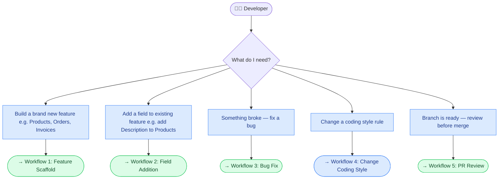
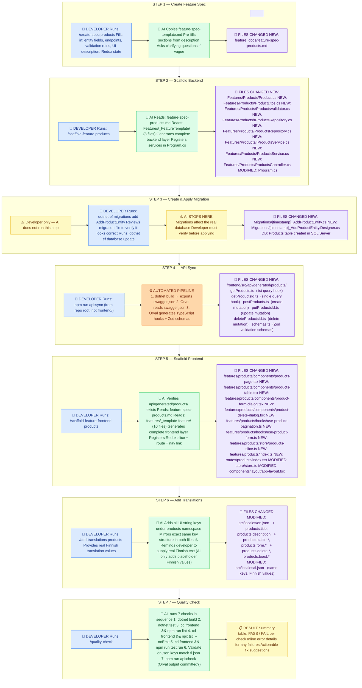
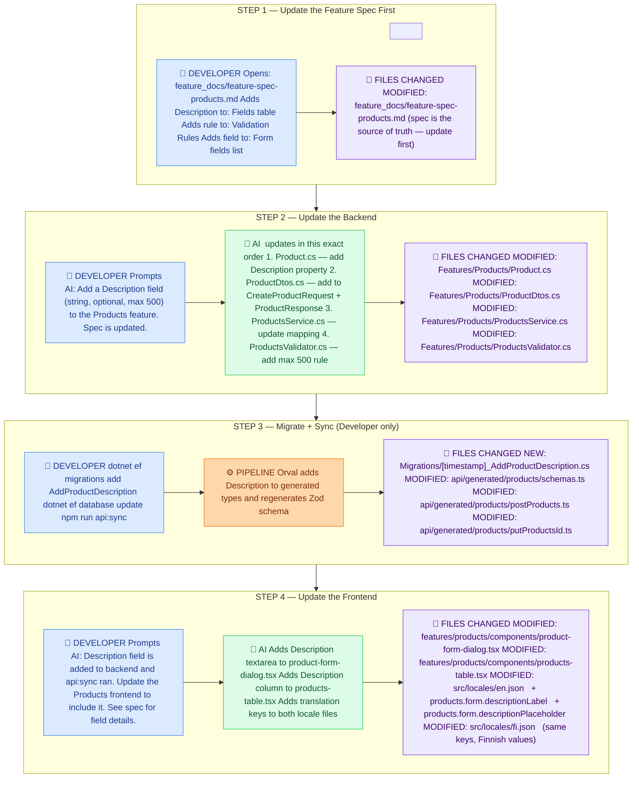
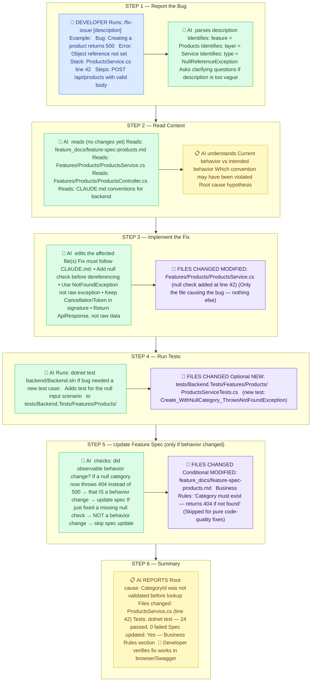
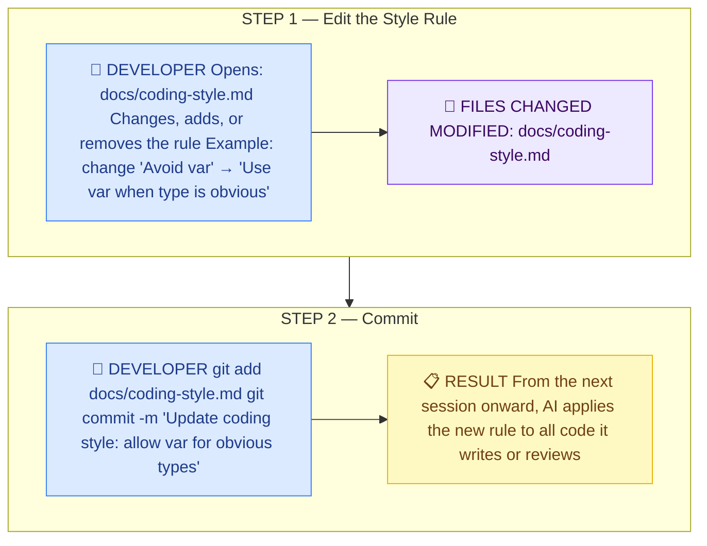

# AI Workflow Visual Guide

> Open VSCode Markdown preview (`Ctrl+Shift+V`) to see rendered diagrams.
> Requires [Markdown Preview Mermaid Support](https://marketplace.visualstudio.com/items?itemName=bierner.markdown-mermaid) extension.

**Color key:** 🔵 Blue = Developer action · 🟢 Green = AI action · 🟣 Purple = Files changed · 🟠 Orange = Automated pipeline · 🟡 Yellow = Result

---

## Overview — Which Workflow?

---

## Workflow 1 — Build a New Feature End-to-End

---

## Workflow 2 — Add a Field to an Existing Entity

**Example:** Add `Description` (string, optional, max 500 chars) to the Products feature.

---

## Workflow 3 — Fix a Bug

**Example:** Creating a product returns HTTP 500.

---

## Workflow 4 — Change a Coding Style Rule

**Example:** Switch from explicit types to `var` for obvious assignments in C#.

---

## Workflow 5 — PR / Code Review

**Example:** Developer finished the Products feature branch and wants a review before merging.

```mermaid
flowchart TD
    classDef dev fill:#dbeafe,stroke:#3b82f6,color:#1e3a8a
    classDef ai fill:#dcfce7,stroke:#22c55e,color:#14532d
    classDef files fill:#ede9fe,stroke:#7c3aed,color:#3b0764
    classDef result fill:#fef9c3,stroke:#eab308,color:#713f12

    subgraph STEP1["STEP 1 — Request Review"]
        direction LR
        D1["🧑 DEVELOPER Prompts: Review my code on the products-feature branch  Optional context to add: • What the branch does • Any areas of concern • Whether to check specific layers only"]:::dev
        A1["🤖 PR REVIEWER AGENT  gathers context git diff main...HEAD --stat git log main...HEAD --oneline  Finds: 12 files changed, +430 -18 Commits: 3 commits on this branch"]:::ai
        D1 --> A1
    end

    subgraph STEP2["STEP 2 — Read All Changed Files"]
        direction LR
        A2["🤖 AI  reads every modified file in full Not just the diff — reads complete file to understand context around each change  Example files read: Features/Products/ProductsService.cs Features/Products/ProductsController.cs features/products/components/products-page.tsx features/products/store/products-slice.ts src/locales/en.json"]:::ai
        R2["📋 AI builds understanding What changed and why Which patterns were used What conventions apply"]:::result
        A2 --> R2
    end

    subgraph STEP3["STEP 3 — Check Project Conventions"]
        direction LR
        A3["🤖 AI  checks each convention from CLAUDE.md"]:::ai
        R3["📋 BACKEND CHECKLIST ✓ Entity inherits BaseEntity ✓ All read queries use AsNoTracking ✓ OrderBy before Skip/Take on paginated queries ✓ All controllers return ApiResponse ✓ CancellationToken passed through full chain ✓ BCrypt used for passwords (not SHA256) ✓ No secrets in appsettings.json ✓ Services registered in Program.cs ✓ Uses NotFoundException / ValidationException  📋 FRONTEND CHECKLIST ✓ All UI text uses t() from useTranslation ✓ Keys exist in BOTH en.json AND fi.json ✓ Server data in React Query, not Redux ✓ useAppDispatch / useAppSelector (not raw hooks) ✓ No manual edits to api/generated/ ✓ cn() used for class merging  📋 CODING STYLE CHECKLIST (docs/coding-style.md) ✓ C# naming: PascalCase methods, _camelCase private fields ✓ File-scoped namespaces in all C# files ✓ No var where type is not obvious ✓ TS naming: PascalCase components, camelCase hooks ✓ Named exports for components and hooks ✓ cn() for Tailwind class merging"]:::result
        A3 --> R3
    end

    subgraph STEP4["STEP 4 — SOLID Principles Review"]
        direction LR
        A4["🤖 AI  evaluates each SOLID principle"]:::ai
        R4["📋 SOLID EVALUATION SRP — ProductsService has one reason to change? OCP — Can add new product types without modifying service? LSP — Repository interface correctly substitutable? ISP — IProductsRepository not bloated with unrelated methods? DIP — Controller depends on IProductsService, not impl?"]:::result
        A4 --> R4
    end

    subgraph STEP5["STEP 5 — Review Report"]
        direction LR
        R5["📋 REVIEW REPORT EXAMPLE  Branch: products-feature  Base: main  Date: 2026-02-20 Summary: Adds full CRUD for Products with pagination and soft delete.  SOLID: SRP PASS · OCP PASS · LSP N/A · ISP PASS · DIP PASS  🔴 Critical:   ProductsController.cs:47 — returns raw ProductDto instead of ApiResponse  🟡 Major:   ProductsRepository.cs:23 — GetAllAsync missing AsNoTracking  🔵 Minor:   products-table.tsx:15 — hardcoded string 'No results' should use t()  Testing: ProductsService has no unit tests — 3 methods uncovered  Overall: NEEDS WORK — fix 1 critical before merging"]:::result
        R5
    end

    subgraph STEP6["STEP 6 — Developer Acts on Findings"]
        direction LR
        D6["🧑 DEVELOPER Fixes critical issue: wraps response in ApiResponse Fixes major issue: adds AsNoTracking Fixes minor: adds t() call with translation key Optionally asks AI to write missing tests"]:::dev
        F6["📁 FILES CHANGED MODIFIED: Features/Products/ProductsController.cs MODIFIED: Features/Products/ProductsRepository.cs MODIFIED: features/products/components/products-table.tsx MODIFIED: src/locales/en.json + fi.json"]:::files
        D6 --> F6
    end

    STEP1 --> STEP2 --> STEP3 --> STEP4 --> STEP5 --> STEP6
```

