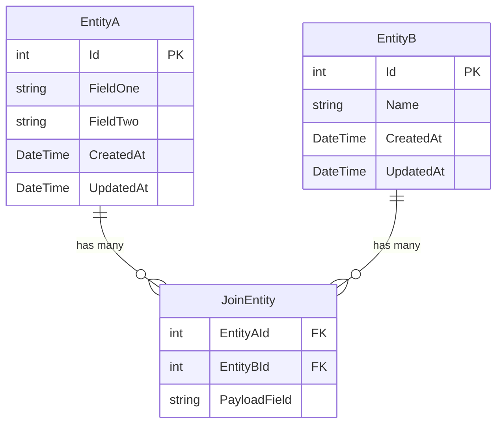

# Feature Data Model Template

> **Opt-in resource** for complex entity modeling.
>
> **Use this when:**
> - Many-to-many relationships with payload on the join table (e.g., `ReservationPersonnel` with a `Role` field)
> - Composite primary keys on join tables
> - Multiple related entities that need to be defined together
> - Non-trivial EF Core configuration (cascade rules, unique indexes, owned types)
>
> **Do NOT use this for:**
> - Simple CRUD features with a single entity and standard belongs-to relationships
> - Features with no relationships or only a single FK
>
> To use: copy the relevant sections into your feature spec under the **Entity** section,
> or keep it as a standalone companion document alongside the spec.

---

## Entity Relationship Diagram



---

## Entity Definitions

### EntityA

| Property | C# Type | Required | Constraints | Notes |
|----------|---------|----------|-------------|-------|
| `FieldOne` | `string` | yes | max 200 chars | |
| `FieldTwo` | `string` | no | max 500 chars | |

> `Id`, `CreatedAt`, `UpdatedAt` inherited from `BaseEntity`.

### EntityB

| Property | C# Type | Required | Constraints | Notes |
|----------|---------|----------|-------------|-------|
| `Name` | `string` | yes | max 200 chars, unique | |

> `Id`, `CreatedAt`, `UpdatedAt` inherited from `BaseEntity`.

### JoinEntity (join table with payload)

| Property | C# Type | Required | Constraints | Notes |
|----------|---------|----------|-------------|-------|
| `EntityAId` | `int` | yes | FK → EntityA | Part of composite PK |
| `EntityBId` | `int` | yes | FK → EntityB | Part of composite PK |
| `PayloadField` | `string` | no | max 100 chars | Optional extra data on the relationship |

> No `BaseEntity` inheritance — composite PK only.

---

## EF Core Configuration Notes

Add to `OnModelCreating` in `AppDbContext.cs`:

```csharp
// Composite primary key on join table
modelBuilder.Entity<JoinEntity>()
    .HasKey(x => new { x.EntityAId, x.EntityBId });

// Unique index example (e.g., unique name per EntityA)
modelBuilder.Entity<EntityB>()
    .HasIndex(x => x.Name)
    .IsUnique();

// Cascade delete: deleting EntityA removes its JoinEntity rows
modelBuilder.Entity<JoinEntity>()
    .HasOne(x => x.EntityA)
    .WithMany(x => x.JoinEntities)
    .HasForeignKey(x => x.EntityAId)
    .OnDelete(DeleteBehavior.Cascade);

// Restrict delete: prevent deleting EntityB if JoinEntity rows exist
modelBuilder.Entity<JoinEntity>()
    .HasOne(x => x.EntityB)
    .WithMany(x => x.JoinEntities)
    .HasForeignKey(x => x.EntityBId)
    .OnDelete(DeleteBehavior.Restrict);
```

---

## Indexes

| Table | Columns | Type | Purpose |
|-------|---------|------|---------|
| `JoinEntities` | `(EntityAId, EntityBId)` | Composite PK (unique) | Primary key, prevents duplicate relationships |
| `EntityBs` | `Name` | Unique | Enforce unique names |

---

## Soft-Delete Behavior

| Trigger | Effect | Implementation |
|---------|--------|---------------|
| Delete `EntityA` | Cascade-delete its `JoinEntity` rows | `OnDelete(DeleteBehavior.Cascade)` |
| Delete `EntityB` | Null the FK on `JoinEntity` (or restrict) | `OnDelete(DeleteBehavior.SetNull)` or `Restrict` |

> **Note:** "Soft-delete" in this project means nulling a FK rather than a physical row delete.
> If EntityB is deleted, set `JoinEntity.EntityBId = null` so the record remains (and the row
> is excluded from reads via a `Where(x => x.EntityBId != null)` filter).
