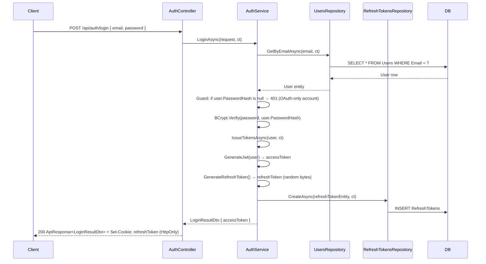
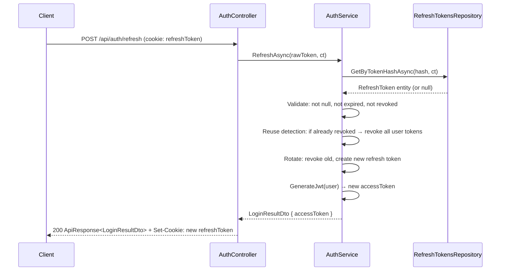

# Feature Specification: Authentication

**Last Updated:** `2026-03-12`
**Tests written:** no

---

## 1. Entity

### RefreshToken

**Name:** `RefreshToken`
**Table name (plural):** `RefreshTokens`

| Property          | C# Type     | Required | Constraints                       | Notes                                  |
| ----------------- | ----------- | -------- | --------------------------------- | -------------------------------------- |
| `Token`           | `string`    | yes      | max 512 chars, unique index       | Hashed value stored in DB              |
| `UserId`          | `int`       | yes      | FK → Users.Id                     | Owning user                            |
| `ExpiresAt`       | `DateTime`  | yes      | must be in the future on creation | UTC                                    |
| `RevokedAt`       | `DateTime?` | no       | null = active                     | Set on logout or rotation              |
| `ReplacedByToken` | `string?`   | no       | max 512 chars                     | Points to the new token after rotation |

> `Id` (int), `CreatedAt`, `UpdatedAt` are inherited from `BaseEntity` — do not add them.

### ExternalLogins (future — not scaffolded yet)

<!-- FUTURE TODO: implement when OAuth is needed -->

**Name:** `ExternalLogin`
**Table name (plural):** `ExternalLogins`

| Property         | C# Type  | Required | Constraints                    | Notes                        |
| ---------------- | -------- | -------- | ------------------------------ | ---------------------------- |
| `UserId`         | `int`    | yes      | FK → Users.Id, cascade delete  | Owning user                  |
| `Provider`       | `string` | yes      | max 50 — `"Google"`, `"Azure"` | OAuth provider name          |
| `ProviderUserId` | `string` | yes      | max 256                        | `sub` claim from OAuth token |
| `ProviderEmail`  | `string` | yes      | max 256                        | Email from provider          |

Unique index on `(Provider, ProviderUserId)`.

> `Id` (int), `CreatedAt`, `UpdatedAt` are inherited from `BaseEntity` — do not add them.

### Note on User entity

The `User` entity already exists in `Features/Users/`. Authentication uses the existing `Email` (string, unique, max 256) and `PasswordHash` (`string?` — **nullable**) fields. No new fields are added to User.

> **`PasswordHash` is nullable** to support future OAuth-only users who never set a password. Local login must reject with 401 if `PasswordHash` is null (user was created via OAuth).

---

## Relationships

- `RefreshToken` belongs to `User` (UserId FK, required, cascade delete)
- `ExternalLogin` belongs to `User` (UserId FK, required, cascade delete) — future

---

## 2. Core Values & Principles

- **Passwords are never stored in plaintext** — always hashed with BCrypt (cost factor ≥ 12)
- **JWTs are short-lived** (15 minutes) to minimize the damage window of a leaked access token
- **Refresh tokens are long-lived** (7 days), stored as HttpOnly cookies to prevent JavaScript access — this is the primary XSS mitigation
- **Refresh token rotation** — each use of a refresh token issues a new one and revokes the old; a reuse attempt invalidates the entire token family (detected theft)
- **No secrets in config files** — JWT signing key and expiry settings come from environment variables / user-secrets only
- **Return URL redirect** — after successful login, the frontend redirects to `returnUrl` (the page the user was trying to reach), defaulting to `/`
- **OAuth-ready design** — `IssueTokensAsync(User user)` is a shared internal method; any future OAuth callback issues the same JWT + refresh token as local login

---

## 3. Architecture Decisions

### JWT stored in memory, refresh token in HttpOnly cookie

**Decision:** Access token (JWT) is stored in JavaScript memory only; refresh token is stored in an HttpOnly, Secure, SameSite=Strict cookie.
**Alternatives Considered:** Both in localStorage; both in cookies; both in memory.
**Rationale:** localStorage is vulnerable to XSS — any injected script can steal tokens. HttpOnly cookies cannot be read by JavaScript, eliminating that attack vector. The short JWT lifetime (15 min) limits blast radius if it leaks through other means.

### Refresh token rotation with reuse detection

**Decision:** Every `/auth/refresh` call issues a new refresh token and immediately revokes the old one. If a revoked token is presented, the entire user session is invalidated.
**Alternatives Considered:** Single long-lived refresh token with no rotation.
**Rationale:** Token rotation means a stolen refresh token has a very narrow window. Reuse detection catches the case where an attacker has a copy of a token — using it reveals theft and the legitimate user is forced to re-login.

### Separate `RefreshTokens` table (not embedded in User)

**Decision:** Refresh tokens are stored in their own table with `UserId` FK.
**Alternatives Considered:** Storing a single refresh token hash on the User row.
**Rationale:** A user can be logged in from multiple devices simultaneously. A single-field approach would log out all other sessions on every refresh. A separate table supports concurrent sessions and per-device revocation.

### Shared `IssueTokensAsync` for OAuth-readiness

**Decision:** `AuthService` exposes an internal `IssueTokensAsync(User user, CancellationToken ct)` method that generates a JWT + refresh token and persists the refresh token. Both `LoginAsync` (local) and the future OAuth callback call this shared method.
**Rationale:** Avoids duplicating token-issuance logic when OAuth is added. The OAuth callback handler (future) only needs to find-or-create the `User` record, then call `IssueTokensAsync` — it gets the same cookie + JWT behavior for free.

### Login identifier: Email (not username)

**Decision:** Local login uses `Email` as the identifier, not a separate username field.
**Rationale:** The `User` entity already has a unique `Email` field. Using it as the login identifier avoids adding a redundant `Username` column. `UsersRepository.GetByEmailAsync()` is reused as-is for lookup.

---

## 4. Data Flow

### Login

**Flow walkthrough:**

1. Client POSTs credentials
2. Service fetches User by email; returns 401 if not found (generic message — never reveal whether email exists)
3. If `PasswordHash` is null (OAuth-only account), return 401 with generic message
4. Service verifies BCrypt hash; returns 401 on mismatch
5. `IssueTokensAsync` generates a signed JWT (15 min) and a cryptographically random refresh token (32 bytes → base64url)
6. Refresh token is hashed (SHA256 — not a password, a random secret) before storage
7. Controller sets the refresh token as an HttpOnly cookie and returns the JWT in the body

### Refresh

### Logout

1. Client POSTs `/api/auth/logout` (cookie present)
2. Service hashes the cookie value, finds the `RefreshToken` row, sets `RevokedAt = now`
3. Controller clears the cookie (expires it)
4. Returns 204

---

## 5. API Endpoints

| Method | Route               | Description                              | Auth required    |
| ------ | ------------------- | ---------------------------------------- | ---------------- |
| `POST` | `/api/auth/login`   | Login with email + password              | no               |
| `POST` | `/api/auth/refresh` | Issue new JWT using refresh token cookie | no (cookie auth) |
| `POST` | `/api/auth/logout`  | Revoke refresh token, clear cookie       | no (cookie auth) |
| `GET`  | `/api/auth/me`      | Return current user profile              | yes (JWT bearer) |

### Future OAuth endpoints (not implemented)

<!-- FUTURE TODO: implement when OAuth is needed -->

| Method | Route                           | Description                                                                               | Auth required |
| ------ | ------------------------------- | ----------------------------------------------------------------------------------------- | ------------- |
| `GET`  | `/api/auth/external/{provider}` | Redirect to OAuth provider authorize URL                                                  | no            |
| `POST` | `/api/auth/external/callback`   | Exchange code → find-or-create user → call `IssueTokensAsync` → issue JWT + refresh token | no            |

---

## 6. Validation Rules

### Login request (`LoginRequest`)

- `Email`: required, not empty, valid email format, max 256 characters
- `Password`: required, not empty, max 200 characters

> No extra format strictness on login inputs beyond email format — errors surface as "invalid credentials" to avoid user enumeration.

---

## 7. Business Rules

### Seed Admin User

On application startup in the **Development** environment only, `DataSeeder.SeedAdminUserAsync` runs and creates one admin user if none exists:

| Field          | Value                                     |
| -------------- | ----------------------------------------- |
| `Email`        | `admin@example.com`                       |
| `FirstName`    | `"Admin"`                                 |
| `LastName`     | `"User"`                                  |
| `Role`         | `"Admin"`                                 |
| `PasswordHash` | BCrypt hash (cost 12) of `"password123"`  |
| `IsActive`     | `true`                                    |

**Rules:**
- The password is the hardcoded development default `"password123"` — this is intentional for the Development environment only and must never be used in production.
- The check is by email (`admin@example.com`) — if a user with that email already exists, the method is a no-op (idempotent).
- The `IConfiguration` parameter is accepted by the method signature (for future use), but the password is not currently read from config. A guard for a blank password is present as dead code, kept for when config-driven seeding is adopted.

---

- **Generic error on bad credentials:** Always return `401 Unauthorized` with the message `"Invalid email or password"` — never indicate whether the email exists or the password was wrong
- **OAuth-only account login attempt:** If `user.PasswordHash` is null, return `401 Unauthorized` with the same generic message `"Invalid email or password"` — do not reveal the account exists or that it is OAuth-only
- **Expired refresh token:** Returns `401 Unauthorized`; cookie is cleared
- **Revoked refresh token (reuse detected):** Revoke ALL active refresh tokens for that user, return `401 Unauthorized` with message `"Session invalidated due to suspicious activity"` — forces full re-login on all devices
- **Refresh token hash:** Store `SHA256(rawToken)` in the DB — the raw token travels only over the wire and in the cookie; the DB stores only its hash
- **BCrypt cost factor:** Minimum 12 in production
- **JWT claims:** `sub` (userId), `email`, `iat`, `exp`
- **Cookie settings:** `HttpOnly=true`, `Secure=true` (HTTPS only), `SameSite=Strict`, `Path=/api/auth`

### Acceptance Scenarios

**Scenario: Successful login**

- Given: POST `/api/auth/login` with `{ email: "alice@example.com", password: "correct-password" }`
- When: the request is processed
- Then: returns 200 with `ApiResponse<LoginResultDto>` containing a JWT; response sets an HttpOnly cookie named `refreshToken`

**Scenario: Wrong password**

- Given: POST `/api/auth/login` with `{ email: "alice@example.com", password: "wrong-password" }`
- When: the request is processed
- Then: returns 401 with message `"Invalid email or password"` — no indication of which field was wrong

**Scenario: Non-existent email**

- Given: POST `/api/auth/login` with `{ email: "nobody@example.com", password: "anything" }`
- When: the request is processed
- Then: returns 401 with message `"Invalid email or password"` — same response as wrong password

**Scenario: OAuth-only account tries password login**

- Given: POST `/api/auth/login` with a valid email whose `User.PasswordHash` is null
- When: the request is processed
- Then: returns 401 with message `"Invalid email or password"` — no indication the account exists or is OAuth-only

**Scenario: Successful token refresh**

- Given: POST `/api/auth/refresh` with a valid, non-expired refresh token cookie
- When: the request is processed
- Then: returns 200 with a new JWT; response sets a new `refreshToken` HttpOnly cookie; old refresh token is revoked in DB

**Scenario: Expired refresh token**

- Given: POST `/api/auth/refresh` with a refresh token whose `ExpiresAt` is in the past
- When: the request is processed
- Then: returns 401; refresh token cookie is cleared

**Scenario: Reused (stolen) refresh token**

- Given: POST `/api/auth/refresh` with a refresh token that was already rotated (i.e., `RevokedAt` is set)
- When: the request is processed
- Then: returns 401; ALL active refresh tokens for the associated user are revoked; cookie is cleared

**Scenario: Successful logout**

- Given: POST `/api/auth/logout` with a valid refresh token cookie
- When: the request is processed
- Then: returns 204; refresh token `RevokedAt` is set; cookie is cleared

**Scenario: Get current user (authenticated)**

- Given: GET `/api/auth/me` with a valid JWT in `Authorization: Bearer <token>`
- When: the request is processed
- Then: returns 200 with `ApiResponse<UserDto>` containing the current user's profile

**Scenario: Get current user (unauthenticated)**

- Given: GET `/api/auth/me` with no or invalid JWT
- When: the request is processed
- Then: returns 401

**Scenario: Login with missing fields**

- Given: POST `/api/auth/login` with empty `email` or `password`
- When: the request is processed
- Then: returns 400 with validation errors

---

## 8. Authorization

- `POST /api/auth/login` — public
- `POST /api/auth/refresh` — public (protected by HttpOnly cookie — no JWT needed)
- `POST /api/auth/logout` — public (protected by HttpOnly cookie)
- `GET /api/auth/me` — requires valid JWT bearer token (`[Authorize]`)
- All other application endpoints should use `[Authorize]` by default unless explicitly marked public

---

## 9. Frontend UI

### Design reference

No Figma design — standard login page.

### Description

Full-page centered login card (not a dialog). Layout:

- App logo / name at the top of the card
- `Email` input (type=email, autofocus)
- `Password` input (type=password, show/hide toggle button)
- `Sign in` submit button (full width, shows loading spinner while request is in-flight)
- Inline error banner below the form (red, dismissible) showing server error messages (e.g. "Invalid email or password")
- No "Remember me" checkbox
- No "Forgot password" link (not in scope)

**Behavior:**

- On successful login: redirect to `returnUrl` query param if present and same-origin, otherwise redirect to `/`
- On failure: display error message inline, do not clear the email field, clear the password field
- The route `/login` is public — if a user with a valid JWT navigates to `/login`, redirect them to `/` immediately
- All other routes are protected — if a user without a JWT navigates to a protected route, redirect to `/login?returnUrl=<current-path>`

**Token management (frontend):**

- Access token (JWT) stored in a React context / in-memory variable (not localStorage, not sessionStorage)
- On app load / page refresh: immediately call `POST /api/auth/refresh` to get a new access token using the existing cookie; if it fails (401), treat user as logged out
- Axios/fetch interceptor: on 401 response from any API call, attempt one silent refresh; if refresh also fails, redirect to login

### Redux UI state

- `isLoggingIn: boolean` — true while login request is in-flight
- `loginError: string | null` — current error message to display

> Access token itself is NOT in Redux — it lives in a React auth context to avoid serialization into the store.

---

## 10. File Locations

### Backend

| File                 | Path                                                                |
| -------------------- | ------------------------------------------------------------------- |
| RefreshToken entity  | `backend/src/Backend.Api/Features/Auth/RefreshToken.cs`             |
| Auth DTOs            | `backend/src/Backend.Api/Features/Auth/AuthDtos.cs`                 |
| Login validator      | `backend/src/Backend.Api/Features/Auth/AuthValidator.cs`            |
| Repository interface | `backend/src/Backend.Api/Features/Auth/IRefreshTokensRepository.cs` |
| Repository           | `backend/src/Backend.Api/Features/Auth/RefreshTokensRepository.cs`  |
| Service interface    | `backend/src/Backend.Api/Features/Auth/IAuthService.cs`             |
| Service              | `backend/src/Backend.Api/Features/Auth/AuthService.cs`              |
| Controller           | `backend/src/Backend.Api/Features/Auth/AuthController.cs`           |
| JWT config           | `backend/src/Backend.Api/Common/Auth/JwtSettings.cs`                |
| Data seeder          | `backend/src/Backend.Api/Data/DataSeeder.cs`                        |

### Frontend

| File                    | Path                                                   |
| ----------------------- | ------------------------------------------------------ |
| Auth context            | `frontend/src/auth/auth-context.tsx`                   |
| Auth provider           | `frontend/src/auth/auth-provider.tsx`                  |
| Login page              | `frontend/src/features/auth/components/login-page.tsx` |
| Login form              | `frontend/src/features/auth/components/login-form.tsx` |
| Redux slice             | `frontend/src/features/auth/store/auth-slice.ts`       |
| Protected route wrapper | `frontend/src/components/protected-route.tsx`          |
| Route                   | `frontend/src/routes/login/index.tsx`                  |

---

## 11. Tests

**Tests written:** no

### Backend Unit Tests

| Test                                                       | Description                                                |
| ---------------------------------------------------------- | ---------------------------------------------------------- |
| `LoginAsync_WithValidCredentials_ReturnsAccessToken`       | Happy path — valid user gets JWT                           |
| `LoginAsync_WithWrongPassword_Throws401`                   | Generic 401, no email leak                                 |
| `LoginAsync_WithUnknownEmail_Throws401`                    | Same generic 401 as wrong password                         |
| `LoginAsync_WithNullPasswordHash_Throws401`                | OAuth-only account rejects password login with generic 401 |
| `RefreshAsync_WithValidToken_RotatesTokenAndReturnsNewJwt` | Token rotation works                                       |
| `RefreshAsync_WithExpiredToken_Throws401`                  | Expired tokens rejected                                    |
| `RefreshAsync_WithRevokedToken_RevokesAllUserTokens`       | Reuse detection invalidates session                        |
| `LogoutAsync_RevokesRefreshToken`                          | Token `RevokedAt` is set                                   |

### Frontend Tests

| Test                                          | Description            |
| --------------------------------------------- | ---------------------- |
| `LoginPage renders email and password fields` | Basic render           |
| `LoginPage shows error on 401 response`       | Error banner appears   |
| `LoginPage redirects to returnUrl on success` | Redirect behavior      |
| `LoginPage redirects to / when no returnUrl`  | Default redirect       |
| `AuthProvider calls /refresh on mount`        | Silent refresh on load |

---

## Migration Names

1. `AddRefreshTokenEntity` — creates `RefreshTokens` table
2. `MakePasswordHashNullable` — makes `Users.PasswordHash` nullable (required for OAuth-only accounts)

> Run `dotnet ef database update` after each migration.

---

> **Marker convention:** Both marker types must be resolved before running `/scaffold-feature`:
>
> - `<!-- FUTURE TODO: [what is missing] -->` — AI flags missing info that may have a reasonable default
> - `[NEEDS CLARIFICATION: [question] ]` — requires a specific human answer before scaffolding

## Checklist

### Backend

- [ ] `RefreshToken` entity created
- [ ] `AuthDtos.cs` created (LoginRequest with `email` field, LoginResultDto, UserDto)
- [ ] `AuthValidator.cs` created
- [ ] `RefreshTokensRepository` interface + implementation created
- [ ] `AuthService` interface + implementation created (with shared `IssueTokensAsync` method)
- [ ] `AuthController` created with `/login`, `/refresh`, `/logout`, `/me`
- [ ] JWT settings bound from environment / user-secrets in `Program.cs`
- [ ] `IRefreshTokensRepository` + `IAuthService` registered in `Program.cs`
- [ ] `AddAuthentication(JwtBearer)` configured in `Program.cs`
- [ ] Migration `AddRefreshTokenEntity` created and applied
- [ ] Migration `MakePasswordHashNullable` created and applied

### API Sync

- [ ] `npm run api:sync` run from repo root

### Frontend

- [ ] `auth-context.tsx` + `auth-provider.tsx` created
- [ ] `login-page.tsx` + `login-form.tsx` created (Email input, not Username)
- [ ] Redux `auth-slice.ts` registered in `store/index.ts`
- [ ] `protected-route.tsx` wraps all authenticated routes
- [ ] `/login` route added; redirect if already authenticated
- [ ] All non-auth routes wrapped with `ProtectedRoute`
- [ ] Translations added to both `en.json` and `fi.json`
- [ ] Silent refresh on app load implemented in `AuthProvider`
- [ ] 401 interceptor implemented in `apiFetch.ts`
