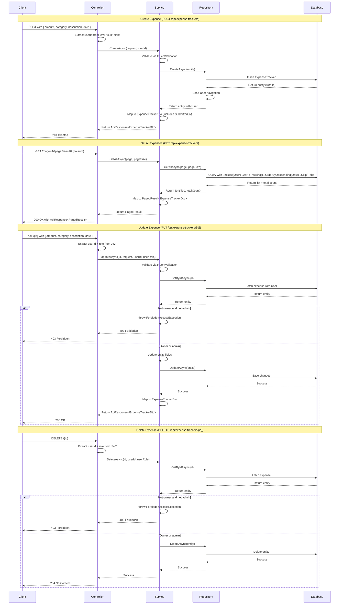

# Feature Specification: ExpenseTracker

**Last Updated:** `2026-03-13`
**Tests written:** no
**Status:** Scaffolded (backend + frontend implemented)

---

## 1. Entity

**Name:** `ExpenseTracker`
**Table name (plural):** `ExpenseTrackers`

### Fields

| Property      | C# Type    | Required | Constraints                                                                    | Notes                                             |
| ------------- | ---------- | -------- | ------------------------------------------------------------------------------ | ------------------------------------------------- |
| `Amount`      | `decimal`  | yes      | > 0, ≤ 999999.99, 2 decimal places                                             |                                                   |
| `Category`    | `string`   | yes      | max 50 chars; must be one of: Food, Transport, Utilities, Entertainment, Other | Validated via FluentValidation                    |
| `Description` | `string?`  | no       | max 500 chars                                                                  | Optional free-text                                |
| `Date`        | `DateTime` | yes      | —                                                                              | When the expense occurred                         |
| `UserId`      | `int`      | yes      | FK → User                                                                      | Set from JWT `sub` claim, never from request body |

> `Id` (int), `CreatedAt`, `UpdatedAt` are inherited from `BaseEntity` — do not add them.

---

## Relationships

- Belongs to `User` (`UserId` FK, required, navigation property `User`)

---

## 2. Core Values & Principles

- Shared visibility: every user (and anonymous visitors) can browse all expenses regardless of who submitted them
- Ownership integrity: only the submitter or an admin may modify or delete an expense
- `UserId` is system-assigned from the JWT token — it is never client-supplied, preventing impersonation
- Category values are validated against a fixed allow-list to keep data clean

---

## 3. Architecture Decisions

### Authorization Enforcement Layer

**Decision**: Ownership checks (`userId == expense.UserId || role == "Admin"`) are enforced in the **Service layer** (not in the controller or repository).

**Alternatives Considered**:

- Controller-level checks via custom `[AuthorizeOwner]` attribute — rejected because it requires reflection or multiple roundtrips to fetch the entity
- Repository-level filtering — rejected because it spreads business logic into the data layer

**Rationale**: Service layer is the correct place for business rules and authorization logic. It keeps the controller thin, the repository data-focused, and makes the authorization logic testable in isolation.

---

### ForbiddenAccessException as a New Exception Type

**Decision**: Introduced a new `ForbiddenAccessException` in `Common/Exceptions/`, mapped to HTTP 403 in `ErrorHandlingMiddleware`.

**Alternatives Considered**:

- Reuse `UnauthorizedAccessException` (built-in .NET) — rejected because it's semantically for authentication failures (401), not authorization failures (403)
- Return a custom result object from the service — rejected because exceptions are idiomatic for .NET error handling and integrate cleanly with middleware

**Rationale**: HTTP 403 Forbidden is the correct status code when a user is authenticated but lacks permission to perform an action. A dedicated exception type makes intent explicit, improves logging clarity, and aligns with the existing exception handling pattern (`NotFoundException`, `ValidationException`).

---

### Category Stored as String (Not Enum)

**Decision**: Category is stored as a `string` in the database and validated via FluentValidation `.Must()` rule, not as a C# enum.

**Alternatives Considered**:

- Enum stored as integer — rejected because OpenAPI/Orval integration works better with strings; enums require manual mapping in DTOs
- Separate Category entity table — rejected because the list is small, fixed, and unlikely to require localization or per-user customization

**Rationale**: Using strings keeps the API contract simple and avoids enum serialization complexity. FluentValidation ensures only valid values are accepted.

---

## 4. Data Flow

### Walkthrough

**Create Flow:**

1. Client sends POST `/api/expense-trackers` with `{ amount, category, description, date }` and an Authorization header (JWT)
2. Controller extracts `userId` from the JWT's `sub` claim (via `GetCurrentUserId()` helper)
3. Controller passes the request + `userId` to `ExpenseTrackersService.CreateAsync()`
4. Service validates the request using FluentValidation (`CreateExpenseTrackerRequestValidator`) — throws `ValidationException` if invalid
5. Service creates a new `ExpenseTracker` entity, setting `UserId` from the parameter (never from request body)
6. Service calls `Repository.CreateAsync()` which inserts the entity and reloads the `User` navigation property
7. Service maps the entity to `ExpenseTrackerDto` (includes `SubmittedBy` = `User.FirstName + User.LastName`)
8. Service returns `ApiResponse<ExpenseTrackerDto>`, controller returns 201 Created with the DTO

**Read Flow (List):**

1. Client sends GET `/api/expense-trackers?page=1&pageSize=20` — no authentication required (`[AllowAnonymous]`)
2. Controller calls `ExpenseTrackersService.GetAllAsync(page, pageSize)`
3. Service validates pagination parameters (page ≥ 1, pageSize 1-100) — throws `ValidationException` if invalid
4. Repository queries with `.Include(e => e.User)` to load submitter, `.AsNoTracking()` for read-only efficiency, `.OrderByDescending(e => e.Date).ThenByDescending(e => e.Id)` for deterministic pagination, and `.Skip()/.Take()` for paging
5. Repository returns `(List<ExpenseTracker>, int totalCount)`
6. Service maps entities to `PagedResult<ExpenseTrackerDto>` and returns it wrapped in `ApiResponse`

**Update Flow:**

1. Client sends PUT `/api/expense-trackers/{id}` with `{ amount, category, description, date }` and JWT
2. Controller extracts `userId` and `role` from JWT (via `GetCurrentUserId()` and `GetCurrentUserRole()` helpers)
3. Controller passes `id`, `request`, `userId`, and `userRole` to `ExpenseTrackersService.UpdateAsync()`
4. Service validates the request using FluentValidation — throws `ValidationException` if invalid
5. Service fetches the expense via `Repository.GetByIdAsync(id)` — throws `NotFoundException` if not found
6. Service calls `EnsureOwnerOrAdmin(entity, userId, userRole)` which checks `expense.UserId == userId || userRole == "Admin"` (case-insensitive) — throws `ForbiddenAccessException` if neither
7. Service updates entity fields (`Amount`, `Category`, `Description`, `Date`), calls `Repository.UpdateAsync()`
8. Repository updates the entity in the database (EF Core's change tracker automatically updates `UpdatedAt` via `SaveChangesAsync` override)
9. Service maps the updated entity to `ExpenseTrackerDto` and returns it wrapped in `ApiResponse`, controller returns 200 OK

**Delete Flow:**

1. Client sends DELETE `/api/expense-trackers/{id}` with JWT
2. Controller extracts `userId` and `role` from JWT
3. Controller passes `id`, `userId`, and `userRole` to `ExpenseTrackersService.DeleteAsync()`
4. Service fetches the expense — throws `NotFoundException` if not found
5. Service calls `EnsureOwnerOrAdmin()` — throws `ForbiddenAccessException` if not owner and not admin
6. Service calls `Repository.DeleteAsync(entity)`
7. Repository removes the entity and saves changes
8. Controller returns 204 No Content

---

## 5. API Endpoints

| Method   | Route                        | Description                  | Auth required |
| -------- | ---------------------------- | ---------------------------- | ------------- |
| `GET`    | `/api/expense-trackers`      | Paginated list (public)      | no            |
| `GET`    | `/api/expense-trackers/{id}` | Get single expense (public)  | no            |
| `POST`   | `/api/expense-trackers`      | Create new expense           | yes           |
| `PUT`    | `/api/expense-trackers/{id}` | Update (owner or admin only) | yes           |
| `DELETE` | `/api/expense-trackers/{id}` | Delete (owner or admin only) | yes           |

---

## 6. Validation Rules

- `Amount`: required, must be > 0, must be ≤ 999999.99
- `Category`: required, not empty, max 50 characters, must be one of `Food`, `Transport`, `Utilities`, `Entertainment`, `Other`
- `Description`: optional; when provided, max 500 characters
- `Date`: required

---

## 7. Business Rules

1. **UserId from JWT:** On create, `UserId` is extracted from the JWT `sub` claim — it is never accepted in the request body
2. **Ownership check (Update):** Service verifies `expense.UserId == currentUserId || currentUserRole == "Admin"`. If neither, throws `ForbiddenAccessException`
3. **Ownership check (Delete):** Same rule as Update
4. **Public read:** GET endpoints require no authentication — anyone can view all expenses

### Acceptance Scenarios

**Scenario: Create with valid data**

- Given: an authenticated POST `/api/expense-trackers` with `{ amount: 42.50, category: "Food", description: "Lunch", date: "2026-03-13" }`
- When: the request is processed
- Then: returns 201 with the created expense wrapped in `ApiResponse<ExpenseTrackerDto>`, `userId` matches the JWT `sub` claim, and `submittedBy` shows the user's name

**Scenario: Get all expenses (unauthenticated)**

- Given: a GET `/api/expense-trackers?page=1&pageSize=20` with no auth token
- When: the request is processed
- Then: returns 200 with a paginated list of all expenses with submitter names

**Scenario: Get by ID (unauthenticated)**

- Given: a GET `/api/expense-trackers/5` with no auth token and expense 5 exists
- When: the request is processed
- Then: returns 200 with the single expense wrapped in `ApiResponse<ExpenseTrackerDto>`

**Scenario: Owner updates own expense**

- Given: an authenticated PUT `/api/expense-trackers/5` where `expense.UserId == currentUserId`
- When: the request is processed with valid data
- Then: returns 200 with the updated expense

**Scenario: Admin updates any expense**

- Given: an authenticated PUT `/api/expense-trackers/5` where the current user has role "Admin" but does not own the expense
- When: the request is processed with valid data
- Then: returns 200 with the updated expense

**Scenario: Non-owner non-admin tries to update**

- Given: an authenticated PUT `/api/expense-trackers/5` where `expense.UserId != currentUserId` and role != "Admin"
- When: the request is processed
- Then: returns 403 Forbidden

**Scenario: Owner deletes own expense**

- Given: an authenticated DELETE `/api/expense-trackers/5` where `expense.UserId == currentUserId`
- When: the request is processed
- Then: returns 204 No Content

**Scenario: Admin deletes any expense**

- Given: an authenticated DELETE `/api/expense-trackers/5` where the current user has role "Admin"
- When: the request is processed
- Then: returns 204 No Content

**Scenario: Non-owner non-admin tries to delete**

- Given: an authenticated DELETE `/api/expense-trackers/5` where `expense.UserId != currentUserId` and role != "Admin"
- When: the request is processed
- Then: returns 403 Forbidden

**Scenario: Create with amount ≤ 0**

- Given: an authenticated POST `/api/expense-trackers` with `{ amount: -5, ... }`
- When: the request is processed
- Then: returns 400 with a validation error on Amount

**Scenario: Create with amount > 999999.99**

- Given: an authenticated POST `/api/expense-trackers` with `{ amount: 1000000, ... }`
- When: the request is processed
- Then: returns 400 with a validation error on Amount

**Scenario: Create with invalid category**

- Given: an authenticated POST `/api/expense-trackers` with `{ category: "Shopping", ... }`
- When: the request is processed
- Then: returns 400 with a validation error on Category

**Scenario: Get by non-existent ID**

- Given: a GET `/api/expense-trackers/99999` where no expense with ID 99999 exists
- When: the request is processed
- Then: returns 404 with NotFoundException message

**Scenario: Unauthenticated create attempt**

- Given: a POST `/api/expense-trackers` with no auth token
- When: the request is processed
- Then: returns 401 Unauthorized

---

## 8. Authorization

- GET endpoints are **public** — no authentication required (`[AllowAnonymous]`)
- POST, PUT, DELETE require `[Authorize]`
- PUT and DELETE enforce ownership in the **service layer**: `expense.UserId == currentUserId || role == "Admin"`
- Admin role bypasses ownership check on update and delete

---

## 9. Frontend UI

### Design reference

No Figma design — standard table + form dialog pattern.

### Description

Page header with "Expense Tracker" title and a "New Expense" button (visible only when `accessToken` is present — hidden for anonymous users). Below the header, a filter bar with:

- Search input (searches for `description` or `category`, debounced 300ms) using `useDebounce` hook
- Category dropdown filter (options: All, Food, Transport, Utilities, Entertainment, Other)

Paginated table with columns:

- **Amount** — formatted as Euro currency (`Intl.NumberFormat` with `style: "currency", currency: "EUR"`)
- **Category** — string value (Food/Transport/etc.)
- **Description** — truncated with CSS (`max-w-[200px] truncate`), displays "—" if null
- **Date** — formatted via `Date.toLocaleDateString()`
- **Submitted By** — `expense.submittedBy` (user's `FirstName + LastName` from backend DTO)
- **Actions** column — rendered only when user is logged in; shows Edit/Delete dropdown menu if `canModify(expense)` returns true (checked via `expense.userId === user.id || user.role === "Admin"`)

Filtering is **client-side**: `useExpenseTrackersPagination` hook fetches paginated data from API, then applies search and category filters locally. This is acceptable for small datasets; for larger datasets, backend filtering would be required.

Create/Edit dialog:

- Reuses `ExpenseTrackerFormDialog` component with an optional `expense` prop (null for create, populated for edit)
- Form fields: Amount (number input), Category (select dropdown with 5 allowed values), Description (textarea, optional), Date (HTML date input)
- Form validation uses Zod schema extended from `PostApiExpenseTrackersBody` (Orval-generated) with translated error messages via `useTranslation()`
- **Important**: Amount validation uses `z.number({ error: t(...) })` not `invalid_type_error` — this is because the schema is for form validation, and `error` is the correct syntax for custom error messages on type mismatch
- On submit, creates or updates via Orval-generated mutations (`usePostApiExpenseTrackers` / `usePutApiExpenseTrackersId`), invalidates queries, and shows toast notification

Delete dialog:

- `ExpenseTrackerDeleteDialog` component shows expense amount and category in confirmation message
- Uses `useDeleteApiExpenseTrackersId` mutation

Skeleton loading (5 rows) while `isLoading` is true. Empty state message when `expenses.length === 0`.

Pagination controls at bottom: Previous/Next buttons, page indicator ("Page X of Y"), disabled states when at first/last page.

### 10. Redux UI state

- `searchQuery: string` — description search input
- `categoryFilter: string` — active category filter ("all" | "Food" | "Transport" | "Utilities" | "Entertainment" | "Other")

---

## 11. File Locations

### Backend

| File                 | Path                                                                             |
| -------------------- | -------------------------------------------------------------------------------- |
| Entity               | `backend/src/Backend.Api/Features/ExpenseTrackers/ExpenseTracker.cs`             |
| DTOs                 | `backend/src/Backend.Api/Features/ExpenseTrackers/ExpenseTrackerDtos.cs`         |
| Validator            | `backend/src/Backend.Api/Features/ExpenseTrackers/ExpenseTrackersValidator.cs`   |
| Repository interface | `backend/src/Backend.Api/Features/ExpenseTrackers/IExpenseTrackersRepository.cs` |
| Repository           | `backend/src/Backend.Api/Features/ExpenseTrackers/ExpenseTrackersRepository.cs`  |
| Service interface    | `backend/src/Backend.Api/Features/ExpenseTrackers/IExpenseTrackersService.cs`    |
| Service              | `backend/src/Backend.Api/Features/ExpenseTrackers/ExpenseTrackersService.cs`     |
| Controller           | `backend/src/Backend.Api/Features/ExpenseTrackers/ExpenseTrackersController.cs`  |
| ForbiddenException   | `backend/src/Backend.Api/Common/Exceptions/ForbiddenAccessException.cs`          |

### Frontend

| File            | Path                                                                                  |
| --------------- | ------------------------------------------------------------------------------------- |
| Page component  | `frontend/src/features/expense-trackers/components/expense-trackers-page.tsx`         |
| Table component | `frontend/src/features/expense-trackers/components/expense-trackers-table.tsx`        |
| Form dialog     | `frontend/src/features/expense-trackers/components/expense-tracker-form-dialog.tsx`   |
| Delete dialog   | `frontend/src/features/expense-trackers/components/expense-tracker-delete-dialog.tsx` |
| Pagination hook | `frontend/src/features/expense-trackers/hooks/use-expense-trackers-pagination.ts`     |
| Form hook       | `frontend/src/features/expense-trackers/hooks/use-expense-tracker-form.ts`            |
| Redux slice     | `frontend/src/features/expense-trackers/store/expense-trackers-slice.ts`              |
| Route           | `frontend/src/routes/expense-trackers/index.tsx`                                      |
| Generated API   | `frontend/src/api/generated/expense-trackers/`                                        |

---

## 12. Tests

**Tests written:** no

### Backend Unit Tests

| Test                                                    | Description                             |
| ------------------------------------------------------- | --------------------------------------- |
| `CreateAsync_WithValidData_ReturnsExpenseTrackerDto`    | Happy path create                       |
| `CreateAsync_SetsUserIdFromParameter`                   | UserId comes from JWT, not request body |
| `GetAllAsync_ReturnsPaginatedResult`                    | Correct page and total                  |
| `GetByIdAsync_WithInvalidId_ThrowsNotFoundException`    | 404 for missing entity                  |
| `UpdateAsync_AsOwner_ReturnsUpdatedDto`                 | Owner can update own expense            |
| `UpdateAsync_AsAdmin_ReturnsUpdatedDto`                 | Admin can update any expense            |
| `UpdateAsync_AsNonOwner_ThrowsForbiddenAccessException` | 403 for non-owner non-admin             |
| `DeleteAsync_AsOwner_Succeeds`                          | Owner can delete own expense            |
| `DeleteAsync_AsAdmin_Succeeds`                          | Admin can delete any expense            |
| `DeleteAsync_AsNonOwner_ThrowsForbiddenAccessException` | 403 for non-owner non-admin             |

### Frontend Tests

| Test                                 | Description                                    |
| ------------------------------------ | ---------------------------------------------- |
| `ExpenseTrackersPage renders table`  | Integration: table populated from mocked query |
| `Form dialog submits create request` | Correct payload sent                           |

---

## Seed Data

Implemented in `DataSeeder.SeedExpenseTrackersAsync()`:

- Reuses existing admin user (`admin@example.com`) seeded by `DataSeeder.SeedAdminUserAsync()`
- Reuses 3 test users seeded by `DataSeeder.SeedTestUsersAsync()`:
  - `user1@example.com` — Alice Johnson
  - `user2@example.com` — Bob Smith
  - `user3@example.com` — Carol Williams
  - All use password `password123` (hashed with BCrypt workFactor 12)
- Seeds exactly 10 sample expenses distributed across all 4 users and all 5 categories:
  - User1 (Alice): Food ($12.50 lunch), Transport ($45 taxi), Food ($30 team dinner)
  - User2 (Bob): Utilities ($120 electricity), Entertainment ($8.99 movie), Utilities ($75 internet)
  - User3 (Carol): Food ($25 groceries), Other ($15.50 office supplies)
  - Admin: Transport ($200 bus pass), Entertainment ($55 concert)
- All expenses use UTC dates in March 2026 (spans March 1-10)
- Follows idempotent pattern: `if (await context.ExpenseTrackers.AnyAsync()) return;`

---

## Migration Name

`AddExpenseTrackerEntity`

---

## Checklist

### Backend

- [ ] Entity created in `Features/ExpenseTrackers/ExpenseTracker.cs`
- [ ] DTOs created in `Features/ExpenseTrackers/ExpenseTrackerDtos.cs`
- [ ] Validator created in `Features/ExpenseTrackers/ExpenseTrackersValidator.cs`
- [ ] Repository interface + implementation created
- [ ] Service interface + implementation created
- [ ] Controller created with correct routes and auth attributes
- [ ] ForbiddenAccessException added to Common/Exceptions and ErrorHandlingMiddleware updated
- [ ] Registered in `Program.cs`
- [ ] Migration created and applied
- [ ] Seed data added for test users and expenses

### API Sync

- [ ] `npm run api:sync` run from repo root
- [ ] `api/generated/expense-trackers/` folder generated by Orval

### Frontend

- [ ] `features/expense-trackers/` folder created with all layers
- [ ] Table columns match spec above
- [ ] Form fields match spec above
- [ ] Category filter dropdown implemented
- [ ] Actions column conditionally visible based on auth state
