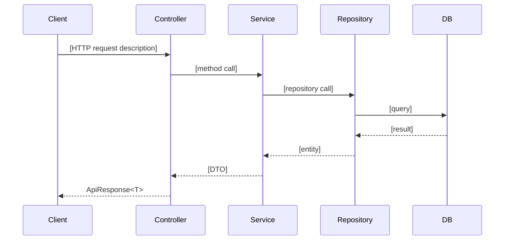

# Feature Specification: Feature

**Last Updated:** `2026-02-19`

<!--
This is the FILLED-IN EXAMPLE spec for the built-in Feature entity.
It documents the _FeatureTemplate backend + features/features/ frontend exactly as-is.

Use this as a reference when filling out your own feature-spec-[name].md.
-->

---

## Entity

**Name:** `Feature`
**Table name (plural):** `Features`

### Fields

| Property | C# Type  | Required | Constraints    | Notes |
| -------- | -------- | -------- | -------------- | ----- |
| `Name`   | `string` | yes      | max 200 chars  |       |

> `Id` (int), `CreatedAt`, `UpdatedAt` are inherited from `BaseEntity` — do not add them.

---

## Core Values & Principles

- [Why this feature exists — design philosophy and goals]
- [Concrete technical rules — the "how" constraints on implementation]

> See `feature-spec-todos.md` for a filled-in example.

---

## Architecture Decisions

### [Decision Title]

**Decision**: [What was decided]
**Alternatives Considered**: [What else was evaluated]
**Rationale**: [Why this was chosen]

### [Decision Title]

**Decision**: [What was decided]
**Alternatives Considered**: [What else was evaluated]
**Rationale**: [Why this was chosen]

> Minimum 2 decisions. Focus on choices a new developer would question — "why not X instead?"

---

## Data Flow

**Flow walkthrough:**

1. [Client sends request with ...]
2. [Controller validates and delegates to Service]
3. [Service applies business rules and calls Repository]
4. [Repository queries the database; result mapped to DTO and returned]

---

## API Endpoints

| Method   | Route               | Description               | Auth required |
| -------- | ------------------- | ------------------------- | ------------- |
| `GET`    | `/api/features`     | Paginated list            | no            |
| `GET`    | `/api/features/{id}`| Get single record         | no            |
| `POST`   | `/api/features`     | Create new record         | no            |
| `PUT`    | `/api/features/{id}`| Full update               | no            |
| `DELETE` | `/api/features/{id}`| Delete record (204)       | no            |

---

## Validation Rules

- `Name`: required, not empty, max 200 characters (both Create and Update)

---

## Business Rules

- none

---

## Authorization

- none

---

## Frontend UI

### Design reference

No Figma design — this is the built-in template example.

### Description

Paginated table with header ("Features" title + "New Feature" button). Columns: ID, Name, Created At, and action dropdown (Edit / Delete). Create/Edit opens a modal with a single Name field. Delete opens a confirmation dialog. Skeleton loading while fetching; empty state message when no records.

### Redux UI state

- `searchQuery: string`
- `selectedIds: string[]`

---

## Migration Name

`AddFeatureEntity`

---

## Checklist

See `docs/feature-generation/implementation-checklist.md` for the full scaffolding checklist.

### Status (Feature example)
- [x] Backend fully implemented
- [x] API synced via Orval
- [x] Frontend fully implemented
