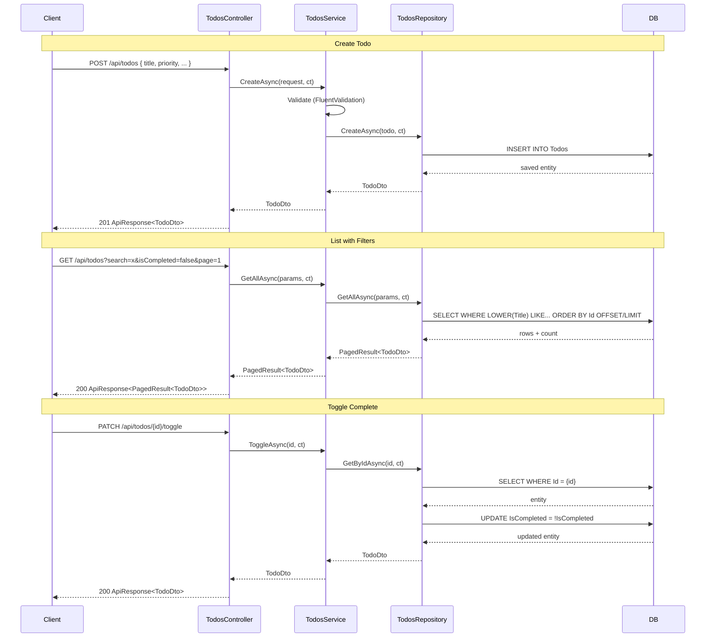

# Feature Specification: Todo

**Last Updated:** 2026-02-20
**Tests written:** yes

---

## Entity

**Name:** `Todo`
**Table name (plural):** `Todos`
**Namespace:** `Backend.Features.Todos`

### Entity Fields

| Property      | C# Type     | Required | DB Column         | Constraints                      | Notes                              |
|---------------|-------------|----------|-------------------|----------------------------------|------------------------------------|
| `Id`          | `int`       | yes      | `Id` (PK)         | Auto-increment                   | Inherited from `BaseEntity`        |
| `Title`       | `string`    | yes      | `varchar(200)`    | max 200 chars, not null          |                                    |
| `Description` | `string?`   | no       | `varchar(1000)`   | max 1000 chars, nullable         |                                    |
| `IsCompleted` | `bool`      | yes      | `boolean`         | default `false`                  | Toggled via `PATCH /toggle`        |
| `DueDate`     | `DateTime?` | no       | `timestamptz`     | nullable, must be future if set  |                                    |
| `Priority`    | `int`       | yes      | `integer`         | 0=Low, 1=Medium, 2=High, default 1 |                                  |
| `CreatedAt`   | `DateTime`  | yes      | `timestamptz`     | Set on insert                    | Inherited from `BaseEntity`        |
| `UpdatedAt`   | `DateTime?` | no       | `timestamptz`     | Set on update                    | Inherited from `BaseEntity`        |

---

## Core Values & Principles

### Core Values

- **User owns their task list** — no shared or collaborative state; each todo belongs to the user who created it
- **Server is the source of truth** — the frontend never derives or caches completion state locally; it always reflects what the server returns
- **Optimistic UI for toggle actions** — toggling completion feels instant; the UI updates before the server responds

### Principles

- `IsCompleted` can only change via the `PATCH /toggle` endpoint — never via `PUT` to prevent accidental overwrites during full updates
- All list queries are deterministically ordered by `Id` before pagination using `.OrderBy(t => t.Id)`
- Search is always case-insensitive using `LOWER().Contains()` — no exact-match or case-sensitive search paths
- Priority is stored as an integer enum (0=Low, 1=Medium, 2=High), not a string, enabling native SQL sorting without casting

---

## Architecture Decisions

### Toggle as Separate PATCH Endpoint

**Decision**: `IsCompleted` is flipped via `PATCH /todos/{id}/toggle` with no request body — the server reads the current state and inverts it.

**Alternatives Considered**:
- Include `isCompleted` in the `PUT` body alongside other fields
- Use a `PATCH` body with `{ "isCompleted": true/false }` explicitly

**Rationale**: Prevents accidental overwrites of completion state during full updates (e.g., a stale client sending `isCompleted: false` while updating the title). Mirrors REST conventions for atomic state transitions. The toggle endpoint is idempotent in effect (always flips), making the intent unambiguous.

### Priority as Integer Enum, Not String

**Decision**: Priority is stored as `int` in the database (0=Low, 1=Medium, 2=High) and mapped to the C# `int` type directly — no separate enum type or lookup table.

**Alternatives Considered**:
- Store as string ("Low"/"Medium"/"High") in the database
- Use a separate `Priorities` lookup table with a foreign key
- Use a C# `enum Priority` with EF Core value conversion

**Rationale**: Integers are sortable natively in SQL and EF Core without casting or conversion. String enums require mapping on every query and add fragility for typos. A lookup table would be over-engineering for a fixed 3-value set that will not change. An EF Core enum conversion adds indirection with no benefit for this use case.

---

## Data Flow

**Flow walkthrough:**

- **Create:** Controller → `TodosService.CreateAsync` → FluentValidation → `IsCompleted` forced to `false` → repository INSERT → `ApiResponse<TodoDto>` (201)
- **List:** Query params → filtered EF Core query (`LOWER()` search, completion/priority filters) → `.OrderBy(t => t.Id).Skip().Take()` → `ApiResponse<PagedResult<TodoDto>>` (200)
- **Toggle:** `PATCH` with no body → service reads entity → inverts `IsCompleted` → saves → returns updated `ApiResponse<TodoDto>` (200)

---

## API Endpoints

| Method    | Route                        | Description                      | Auth Required | Response Body              |
|-----------|------------------------------|----------------------------------|---------------|----------------------------|
| `GET`     | `/api/todos`                 | Paginated list with filters      | no            | `ApiResponse<PagedResult<TodoDto>>` |
| `GET`     | `/api/todos/{id}`            | Get single record by ID          | no            | `ApiResponse<TodoDto>`     |
| `POST`    | `/api/todos`                 | Create new todo                  | no            | `ApiResponse<TodoDto>` (201) |
| `PUT`     | `/api/todos/{id}`            | Full update                      | no            | `ApiResponse<TodoDto>`     |
| `DELETE`  | `/api/todos/{id}`            | Delete (no body)                 | no            | 204 No Content             |
| `PATCH`   | `/api/todos/{id}/toggle`     | Flip `IsCompleted`, return DTO   | no            | `ApiResponse<TodoDto>`     |

### GET /api/todos — Query Parameters

| Param         | Type      | Default | Description                                      |
|---------------|-----------|---------|--------------------------------------------------|
| `page`        | `int`     | `1`     | Page number (1-based)                            |
| `pageSize`    | `int`     | `20`    | Items per page (1–100)                           |
| `search`      | `string?` | `null`  | Case-insensitive search in `Title` or `Description` |
| `isCompleted` | `bool?`   | `null`  | Filter: `true`=completed, `false`=active, `null`=all |
| `priority`    | `int?`    | `null`  | Filter by priority: `0`, `1`, or `2`; `null`=all |

---

## Validation Rules

### CreateTodoRequest
- `Title`: required, not empty, max 200 chars
- `Description`: optional; if provided, max 1000 chars
- `Priority`: must be `0`, `1`, or `2`
- `DueDate`: optional; if provided, must be in the future (> `DateTime.UtcNow`)

### UpdateTodoRequest
- Same rules as `CreateTodoRequest`, plus:
- `IsCompleted`: bool (no validation — any value accepted)

---

## Business Rules

- `IsCompleted` is always set to `false` on creation — cannot be set via `POST`
- The `PATCH /toggle` endpoint atomically flips `IsCompleted` with no request body
- Search is applied case-insensitively using `LOWER().Contains()` in EF Core (translates to `LOWER()` in PostgreSQL)
- Filtering by `search`, `isCompleted`, and `priority` is done at the database level (not in-memory)
- All list queries apply `.OrderBy(t => t.Id)` before `.Skip().Take()` to ensure deterministic pagination

---

## File Locations

### Backend
| File | Path |
|------|------|
| Entity | `backend/src/Backend.Api/Features/Todos/Todo.cs` |
| DTOs | `backend/src/Backend.Api/Features/Todos/TodoDtos.cs` |
| Repository interface | `backend/src/Backend.Api/Features/Todos/ITodosRepository.cs` |
| Repository | `backend/src/Backend.Api/Features/Todos/TodosRepository.cs` |
| Service interface | `backend/src/Backend.Api/Features/Todos/ITodosService.cs` |
| Service | `backend/src/Backend.Api/Features/Todos/TodosService.cs` |
| Validators | `backend/src/Backend.Api/Features/Todos/TodoValidator.cs` |
| Controller | `backend/src/Backend.Api/Features/Todos/TodosController.cs` |
| Migration | `backend/src/Backend.Api/Migrations/*_AddTodoEntity.cs` |

### Frontend
| File | Path |
|------|------|
| Redux slice | `frontend/src/features/todos/store/todos-slice.ts` |
| Store barrel | `frontend/src/features/todos/store/index.ts` |
| Pagination hook | `frontend/src/features/todos/hooks/use-todo-pagination.ts` |
| Page component | `frontend/src/features/todos/components/todos-page.tsx` |
| Table component | `frontend/src/features/todos/components/todos-table.tsx` |
| Form dialog | `frontend/src/features/todos/components/todo-form-dialog.tsx` |
| Delete dialog | `frontend/src/features/todos/components/todo-delete-dialog.tsx` |
| Feature barrel | `frontend/src/features/todos/index.ts` |
| Route | `frontend/src/routes/todos/index.tsx` |
| Generated API | `frontend/src/api/generated/todos/todos.ts` |
| Generated Zod | `frontend/src/api/generated/todos/todos.zod.ts` |

---

## Redux UI State

Slice name: `"todos"` — registered in `frontend/src/store/store.ts`

| Field           | Type                                   | Default  | Description                              |
|-----------------|----------------------------------------|----------|------------------------------------------|
| `searchQuery`   | `string`                               | `""`     | Current search input value               |
| `selectedIds`   | `number[]`                             | `[]`     | Selected row IDs (for future bulk ops)   |
| `statusFilter`  | `"all" \| "active" \| "completed"`     | `"all"`  | Completion filter                        |
| `priorityFilter`| `number \| null`                       | `null`   | Priority filter (`0`/`1`/`2`/`null`=all) |

**Actions:** `setSearchQuery`, `setStatusFilter`, `setPriorityFilter`, `toggleSelected`, `clearSelection`

---

## Frontend UI Description

### Page (`/todos`)
Header with "Todos" title and "New Todo" button (opens create dialog).

Filter bar:
- Search input: debounced (400ms), dispatches `setSearchQuery` to Redux
- Status tabs: All / Active / Completed buttons, dispatches `setStatusFilter`
- Priority dropdown: All Priorities / Low / Medium / High, dispatches `setPriorityFilter`

### Table Columns
| Column      | Display                                              |
|-------------|------------------------------------------------------|
| ID          | Mono font, muted                                     |
| Title       | Truncated at 200px, bold                             |
| Description | Truncated at 60 chars, muted (hidden on mobile)      |
| Priority    | Badge: Low=gray, Medium=yellow, High=red             |
| Due Date    | Formatted date, muted (hidden on small screens)      |
| Status      | Badge: Active=blue, Completed=green                  |
| Created At  | Formatted date (hidden on small screens)             |
| Actions     | Dropdown: Edit, Toggle Complete / Mark Active, Delete |

Completed rows are rendered at 60% opacity.

### Dialogs
- **Create/Edit dialog**: Title (Input), Description (Textarea), Priority (Select), Due Date (date input)
- **Delete dialog**: Confirmation with todo title highlighted in bold

### Orval Hooks Used
| Action        | Hook                        |
|---------------|-----------------------------|
| List (filtered) | `useGetApiTodos`          |
| Create        | `usePostApiTodosWithJson`   |
| Update        | `usePutApiTodosIdWithJson`  |
| Delete        | `useDeleteApiTodosId`       |
| Toggle        | `usePatchApiTodosIdToggle`  |
| Query key     | `getGetApiTodosQueryKey`    |

All mutations invalidate `getGetApiTodosQueryKey()` on success.

---

## Tests

Run backend: `dotnet test backend/tests/Backend.Tests` · Run frontend: `npm run test:run` from `frontend/`

| File | Path | Key assertions |
|------|------|----------------|
| `TodosServiceTests.cs` | `backend/tests/Backend.Tests/Features/Todos/` | `GetAllAsync` (valid/invalid params), `GetByIdAsync` (found/not found), `CreateAsync` (valid, invalid, IsCompleted=false on create), `UpdateAsync` (valid/not found/invalid), `DeleteAsync` (found/not found), `ToggleAsync` (active→completed, completed→active, not found) |
| `TodosControllerTests.cs` | same | Each HTTP action returns expected `ActionResult` wrapping `ApiResponse<T>`; Delete returns `204 NoContent` |
| `TodoValidatorTests.cs` | same | Valid passes; empty/null Title; Title >200; Description >1000; invalid Priority (<0 or >2); past DueDate; IsCompleted accepts any bool (update only) |
| `todos-page.test.tsx` | `frontend/src/features/todos/components/__tests__/` | Page title, "New Todo" button, description text, search input placeholder, status filter buttons render |
