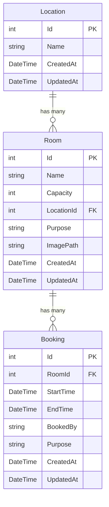

# Feature Specification: Meeting Room Booking

**Last Updated:** `2026-03-06`
**Tests written:** no

---

## 1. Entities

This feature has three related entities: **Location**, **Room**, and **Booking**.

### Entity Relationship Diagram



---

### Location

**Table name:** `Locations`

| Property | C# Type  | Required | Constraints    | Notes |
|----------|----------|----------|----------------|-------|
| `Name`   | `string` | yes      | max 200 chars  |       |

> `Id`, `CreatedAt`, `UpdatedAt` inherited from `BaseEntity`.

---

### Room

**Table name:** `Rooms`

| Property    | C# Type  | Required | Constraints   | Notes                                        |
|-------------|----------|----------|---------------|----------------------------------------------|
| `Name`      | `string` | yes      | max 200 chars |                                              |
| `Capacity`  | `int`    | yes      | min 1         |                                              |
| `LocationId`| `int`    | yes      | FK → Location |                                              |
| `Purpose`   | `string` | no       | max 500 chars | Free-text description of intended room use   |
| `ImagePath` | `string` | no       | max 500 chars | Relative path under `wwwroot/uploads/rooms/` |

> `Id`, `CreatedAt`, `UpdatedAt` inherited from `BaseEntity`.

---

### Booking

**Table name:** `Bookings`

| Property    | C# Type    | Required | Constraints   | Notes                             |
|-------------|------------|----------|---------------|-----------------------------------|
| `RoomId`    | `int`      | yes      | FK → Room     |                                   |
| `StartTime` | `DateTime` | yes      |               | Stored as UTC                     |
| `EndTime`   | `DateTime` | yes      |               | Stored as UTC; must be > StartTime|
| `BookedBy`  | `string`   | yes      | max 200 chars | Name or identifier of booker      |
| `Purpose`   | `string`   | no       | max 500 chars | Reason for the booking            |

> `Id`, `CreatedAt`, `UpdatedAt` inherited from `BaseEntity`.

---

## EF Core Configuration Notes

```csharp
// Restrict delete: prevent deleting a Location if Rooms reference it
modelBuilder.Entity<Room>()
    .HasOne(r => r.Location)
    .WithMany(l => l.Rooms)
    .HasForeignKey(r => r.LocationId)
    .OnDelete(DeleteBehavior.Restrict);

// Restrict delete: prevent deleting a Room if Bookings reference it
modelBuilder.Entity<Booking>()
    .HasOne(b => b.Room)
    .WithMany(r => r.Bookings)
    .HasForeignKey(b => b.RoomId)
    .OnDelete(DeleteBehavior.Restrict);
```

---

## 2. Core Values & Principles

- A booking must always represent a valid, non-overlapping time window for a specific room.
- Room images are optional; the system stores only the file path — not the binary blob.
- Locations are reference data: they must exist before rooms can be assigned to them.
- Rooms with existing bookings cannot be deleted; locations with existing rooms cannot be deleted.
- All times are stored and returned as UTC.

---

## 3. Architecture Decisions

- Standard layered pattern: Controller → Service → Repository → EF Core for all three entities.
- Image upload handled in `RoomsController` via `IFormFile`; service delegates file I/O to a `IFileStorageService` helper (saves to `wwwroot/uploads/rooms/<guid>.<ext>`).
- Static files served via `app.UseStaticFiles()` in `Program.cs` — no separate file controller needed.
- Booking overlap check is performed in `BookingsService` using a DB query before insert/update.
- Locations use an unpaged list endpoint (small reference data); Rooms and Bookings are paginated.

---

## 4. Data Flow

### Rooms — Create (with image)
1. Client POST `/api/rooms` as `multipart/form-data` (fields + optional file).
2. Controller binds `[FromForm] CreateRoomRequest` and optional `IFormFile image`.
3. Service validates request, saves image via `IFileStorageService` → returns relative path.
4. Service maps to `Room` entity, saves via repository.
5. Returns `ApiResponse<RoomDto>` with 201.

### Rooms — Update (with image replacement)
1. Client PUT `/api/rooms/{id}` as `multipart/form-data`.
2. Service loads existing room, deletes old image file if a new one is provided.
3. Saves new image, updates entity fields, persists.

### Bookings — Create (overlap check)
1. Client POST `/api/bookings` with JSON body.
2. Service validates `StartTime < EndTime`.
3. Service queries DB: any booking for same `RoomId` where `StartTime < req.EndTime && EndTime > req.StartTime` → throws `ValidationException` if overlap found.
4. Saves booking, returns `ApiResponse<BookingDto>`.

---

## 5. API Endpoints

### Locations

| Method   | Route                   | Description          | Auth required | Body / Params       |
|----------|-------------------------|----------------------|---------------|---------------------|
| `GET`    | `/api/locations`        | Full unpaged list    | no            | —                   |
| `GET`    | `/api/locations/{id}`   | Get single           | no            | —                   |
| `POST`   | `/api/locations`        | Create               | no            | `{ name }`          |
| `PUT`    | `/api/locations/{id}`   | Update               | no            | `{ name }`          |
| `DELETE` | `/api/locations/{id}`   | Delete               | no            | —                   |

### Rooms

| Method   | Route               | Description                            | Auth required | Body / Params                                              |
|----------|---------------------|----------------------------------------|---------------|------------------------------------------------------------|
| `GET`    | `/api/rooms`        | Paginated list                         | no            | `?page`, `pageSize`, `search`, `locationId`, `sortBy`, `sortDir` |
| `GET`    | `/api/rooms/all`    | Unpaged list (for dropdowns)           | no            | —                                                          |
| `GET`    | `/api/rooms/{id}`   | Get single                             | no            | —                                                          |
| `POST`   | `/api/rooms`        | Create (multipart/form-data)           | no            | fields + optional `image` file                             |
| `PUT`    | `/api/rooms/{id}`   | Update (multipart/form-data)           | no            | fields + optional `image` file                             |
| `DELETE` | `/api/rooms/{id}`   | Delete                                 | no            | —                                                          |

**Rooms list query params:**
- `page` (int, default 1), `pageSize` (int, default 10)
- `search` (string) — filters `Name` contains (case-insensitive)
- `locationId` (int?) — exact match filter
- `sortBy` (`name` | `capacity` | `createdAt`, default `createdAt`)
- `sortDir` (`asc` | `desc`, default `asc`)

### Bookings

| Method   | Route                  | Description       | Auth required | Body / Params                              |
|----------|------------------------|-------------------|---------------|--------------------------------------------|
| `GET`    | `/api/bookings`        | Paginated list    | no            | `?page`, `pageSize`, `roomId`, `fromDate`, `toDate` |
| `GET`    | `/api/bookings/{id}`   | Get single        | no            | —                                          |
| `POST`   | `/api/bookings`        | Create            | no            | JSON body                                  |
| `PUT`    | `/api/bookings/{id}`   | Update            | no            | JSON body                                  |
| `DELETE` | `/api/bookings/{id}`   | Delete            | no            | —                                          |

**Bookings list query params:**
- `page` (int, default 1), `pageSize` (int, default 10)
- `roomId` (int?) — filter by room
- `fromDate` (DateTime?) — bookings with `StartTime >= fromDate`
- `toDate` (DateTime?) — bookings with `EndTime <= toDate`

---

## 6. Validation Rules

### Location
- `Name`: required, not empty, max 200 chars

### Room
- `Name`: required, not empty, max 200 chars
- `Capacity`: required, min value 1
- `LocationId`: required, must reference an existing Location
- `Purpose`: optional, max 500 chars
- `Image` (upload): optional; if provided, must be JPEG or PNG, max 5 MB

### Booking
- `RoomId`: required, must reference an existing Room
- `StartTime`: required
- `EndTime`: required; must be strictly after `StartTime`
- `BookedBy`: required, not empty, max 200 chars
- `Purpose`: optional, max 500 chars

---

## 7. Business Rules

1. **No overlapping bookings:** A new or updated booking for a room cannot overlap any existing booking for the same room. Overlap condition: `existingStart < newEnd AND existingEnd > newStart`. Throws `ValidationException("Room is already booked for the requested time slot.")`.
2. **Room deletion guard:** Attempting to delete a Room that has at least one Booking throws `ValidationException("Room cannot be deleted because it has existing bookings.")`.
3. **Location deletion guard:** Attempting to delete a Location that has at least one Room throws `ValidationException("Location cannot be deleted because it has rooms assigned to it.")`.
4. **Image replacement:** On Room update, if a new image is uploaded, the old image file is deleted from disk before the new one is saved.
5. **Image storage path:** `wwwroot/uploads/rooms/<guid>.<ext>` — GUID generated per upload, extension preserved from original filename.

### Acceptance Scenarios

**Scenario: Create booking — no overlap**
- Given: Room 1 is booked 09:00–10:00 on 2026-03-10
- When: POST `/api/bookings` with RoomId=1, Start=10:00, End=11:00
- Then: 201 created, new booking returned

**Scenario: Create booking — overlap**
- Given: Room 1 is booked 09:00–10:00 on 2026-03-10
- When: POST `/api/bookings` with RoomId=1, Start=09:30, End=10:30
- Then: 400 with `"Room is already booked for the requested time slot."`

**Scenario: Delete room with bookings**
- Given: Room 1 has 2 bookings
- When: DELETE `/api/rooms/1`
- Then: 400 with `"Room cannot be deleted because it has existing bookings."`

**Scenario: Delete location with rooms**
- Given: Location "HQ" has 3 rooms
- When: DELETE `/api/locations/1`
- Then: 400 with `"Location cannot be deleted because it has rooms assigned to it."`

**Scenario: Upload oversized image**
- Given: POST `/api/rooms` with a 6 MB PNG
- When: the request is processed
- Then: 400 with image size validation error

**Scenario: Get rooms list with search**
- Given: Rooms named "Board Room", "Board 2", "Cafeteria"
- When: GET `/api/rooms?search=board`
- Then: Returns paginated result with "Board Room" and "Board 2" only

---

## 8. Authorization

- none (all endpoints are public for this implementation)

---

## 9. Frontend UI

### Design reference

none

### Description

#### Rooms Page (`/rooms`)

Two-tab layout:

**Tab 1 — "Rooms"**
- Top bar: search input (debounced 300ms), location filter dropdown ("All Locations" default), "New Room" button (primary), "Manage Locations" button (secondary/outline).
- Data table columns: Thumbnail (40×40 image or placeholder icon), Name (sortable), Capacity (sortable), Location, Purpose (truncated), Actions (Edit | Delete).
- Column header click toggles sort asc/desc.
- Pagination below table.
- Delete confirmation dialog: warns if room has bookings (error returned from API).
- "New Room" / "Edit" opens a form dialog (see below).

**Tab 2 — "Calendar"**
- Room selector dropdown at the top (populated from `/api/rooms/all`).
- Calendar view (month/week/day) showing bookings for selected room as events (title = BookedBy or Purpose).
- Clicking an empty time slot opens Create Booking dialog pre-filled with selected room and clicked time.
- Clicking an existing event opens Booking Detail panel (showing all fields + Edit / Delete actions).

#### Locations Management

- Accessible via "Manage Locations" button on the Rooms tab — opens a modal or slide-over panel.
- Table with inline rows: Location Name | Edit (inline text input) | Delete (trash icon).
- "Add Location" row at the bottom with an input + Save button.
- Delete shows inline error message if location has rooms.

#### Room Form Dialog (Create / Edit)

Fields:
- Name (text input, required)
- Capacity (number input, required, min 1)
- Location (dropdown, required — populated from locations list)
- Purpose (textarea, optional)
- Image (file input, JPEG/PNG, max 5 MB) — shows current image thumbnail on edit; clearing sets no image.

Submitted as `multipart/form-data`.

#### Bookings Page (`/bookings`)

- Top bar: Room filter dropdown ("All Rooms"), Date From / Date To date pickers, "New Booking" button.
- Data table columns: Room Name, Start Time, End Time, Booked By, Purpose, Actions (Edit | Delete).
- Pagination below table.
- Create/Edit dialog: Room dropdown, Start Time datetime-local, End Time datetime-local, Booked By text, Purpose textarea.
- Overlap error displayed inline in the dialog on submit failure.

---

### 10. Redux UI State

#### Rooms slice (`roomsSlice`)
- `searchQuery: string`
- `locationIdFilter: number | null`
- `sortBy: 'name' | 'capacity' | 'createdAt'`
- `sortDir: 'asc' | 'desc'`
- `activeTab: 'rooms' | 'calendar'`
- `selectedRoomIdForCalendar: number | null`

#### Bookings slice (`bookingsSlice`)
- `roomIdFilter: number | null`
- `fromDate: string | null`
- `toDate: string | null`

> Server data (paginated rooms, bookings, locations list) lives in React Query — not in Redux.

---

## 11. File Locations

### Backend

| File | Path |
|------|------|
| Location entity | `backend/src/Backend.Api/Features/Locations/Location.cs` |
| Location DTOs | `backend/src/Backend.Api/Features/Locations/LocationDtos.cs` |
| Location validator | `backend/src/Backend.Api/Features/Locations/LocationsValidator.cs` |
| Location repository interface | `backend/src/Backend.Api/Features/Locations/ILocationsRepository.cs` |
| Location repository | `backend/src/Backend.Api/Features/Locations/LocationsRepository.cs` |
| Location service interface | `backend/src/Backend.Api/Features/Locations/ILocationsService.cs` |
| Location service | `backend/src/Backend.Api/Features/Locations/LocationsService.cs` |
| Location controller | `backend/src/Backend.Api/Features/Locations/LocationsController.cs` |
| Room entity | `backend/src/Backend.Api/Features/Rooms/Room.cs` |
| Room DTOs | `backend/src/Backend.Api/Features/Rooms/RoomDtos.cs` |
| Room validator | `backend/src/Backend.Api/Features/Rooms/RoomsValidator.cs` |
| Room repository interface | `backend/src/Backend.Api/Features/Rooms/IRoomsRepository.cs` |
| Room repository | `backend/src/Backend.Api/Features/Rooms/RoomsRepository.cs` |
| Room service interface | `backend/src/Backend.Api/Features/Rooms/IRoomsService.cs` |
| Room service | `backend/src/Backend.Api/Features/Rooms/RoomsService.cs` |
| Room controller | `backend/src/Backend.Api/Features/Rooms/RoomsController.cs` |
| File storage service interface | `backend/src/Backend.Api/Features/Rooms/IFileStorageService.cs` |
| File storage service | `backend/src/Backend.Api/Features/Rooms/FileStorageService.cs` |
| Booking entity | `backend/src/Backend.Api/Features/Bookings/Booking.cs` |
| Booking DTOs | `backend/src/Backend.Api/Features/Bookings/BookingDtos.cs` |
| Booking validator | `backend/src/Backend.Api/Features/Bookings/BookingsValidator.cs` |
| Booking repository interface | `backend/src/Backend.Api/Features/Bookings/IBookingsRepository.cs` |
| Booking repository | `backend/src/Backend.Api/Features/Bookings/BookingsRepository.cs` |
| Booking service interface | `backend/src/Backend.Api/Features/Bookings/IBookingsService.cs` |
| Booking service | `backend/src/Backend.Api/Features/Bookings/BookingsService.cs` |
| Booking controller | `backend/src/Backend.Api/Features/Bookings/BookingsController.cs` |

### Frontend

| File | Path |
|------|------|
| Rooms page | `frontend/src/features/rooms/components/rooms-page.tsx` |
| Rooms tab | `frontend/src/features/rooms/components/rooms-tab.tsx` |
| Calendar tab | `frontend/src/features/rooms/components/calendar-tab.tsx` |
| Room table | `frontend/src/features/rooms/components/room-table.tsx` |
| Room form dialog | `frontend/src/features/rooms/components/room-form-dialog.tsx` |
| Room delete dialog | `frontend/src/features/rooms/components/room-delete-dialog.tsx` |
| Locations panel | `frontend/src/features/rooms/components/locations-panel.tsx` |
| Rooms Redux slice | `frontend/src/features/rooms/store/rooms-slice.ts` |
| Rooms route | `frontend/src/routes/rooms/index.tsx` |
| Bookings page | `frontend/src/features/bookings/components/bookings-page.tsx` |
| Booking table | `frontend/src/features/bookings/components/booking-table.tsx` |
| Booking form dialog | `frontend/src/features/bookings/components/booking-form-dialog.tsx` |
| Booking delete dialog | `frontend/src/features/bookings/components/booking-delete-dialog.tsx` |
| Bookings Redux slice | `frontend/src/features/bookings/store/bookings-slice.ts` |
| Bookings route | `frontend/src/routes/bookings/index.tsx` |
| Generated API (rooms) | `frontend/src/api/generated/rooms/` |
| Generated API (locations) | `frontend/src/api/generated/locations/` |
| Generated API (bookings) | `frontend/src/api/generated/bookings/` |

---

## 12. Tests

**Tests written:** no

### Backend Unit Tests

| Test | Description |
|------|-------------|
| `BookingsService_CreateAsync_NoOverlap_ReturnsDto` | Happy path: non-overlapping booking created |
| `BookingsService_CreateAsync_OverlapExists_ThrowsValidationException` | Overlap detected → 400 |
| `BookingsService_CreateAsync_EndBeforeStart_ThrowsValidationException` | Invalid time range → 400 |
| `RoomsService_DeleteAsync_HasBookings_ThrowsValidationException` | Room with bookings cannot be deleted |
| `LocationsService_DeleteAsync_HasRooms_ThrowsValidationException` | Location with rooms cannot be deleted |
| `RoomsService_GetAllAsync_ReturnsPaginatedResult` | Correct page, total, and order |
| `RoomsService_GetByIdAsync_InvalidId_ThrowsNotFoundException` | 404 for missing room |

### Frontend Tests

| Test | Description |
|------|-------------|
| `RoomsPage renders tabs` | Both tabs render; switching works |
| `RoomTable renders rows from mocked query` | Table columns match spec |
| `RoomFormDialog submits multipart create request` | Correct FormData sent |
| `BookingsPage renders table with filters` | Room dropdown and date filters present |
| `BookingFormDialog shows overlap error on 400` | Inline error displayed |

---

## Migration Name

`AddMeetingRoomBookingEntities`

---

## Checklist

### Backend
- [ ] Location entity + DTOs + validator + repository + service + controller created
- [ ] Room entity + DTOs + validator + repository + service + controller created
- [ ] `IFileStorageService` + `FileStorageService` created; static files middleware configured
- [ ] Booking entity + DTOs + validator + repository + service + controller created
- [ ] EF Core `OnModelCreating` — Restrict delete configured for Location→Room and Room→Booking
- [ ] Overlap check implemented in `BookingsService`
- [ ] Deletion guards implemented in `RoomsService` and `LocationsService`
- [ ] All three feature sets registered in `Program.cs`
- [ ] `wwwroot/uploads/rooms/` directory exists (or created at startup)
- [ ] Migration `AddMeetingRoomBookingEntities` created and applied

### API Sync
- [ ] `npm run api:sync` run from repo root
- [ ] `api/generated/rooms/`, `api/generated/locations/`, `api/generated/bookings/` folders generated

### Frontend
- [ ] `features/rooms/` folder created with all layers
- [ ] `features/bookings/` folder created with all layers
- [ ] Rooms Redux slice registered in `store/index.ts`
- [ ] Bookings Redux slice registered in `store/index.ts`
- [ ] `/rooms` route added
- [ ] `/bookings` route added
- [ ] Nav links added in `components/layout/app-layout.tsx`
- [ ] Translations added to BOTH `en.json` AND `fi.json`
- [ ] Calendar library installed (check existing deps first)
