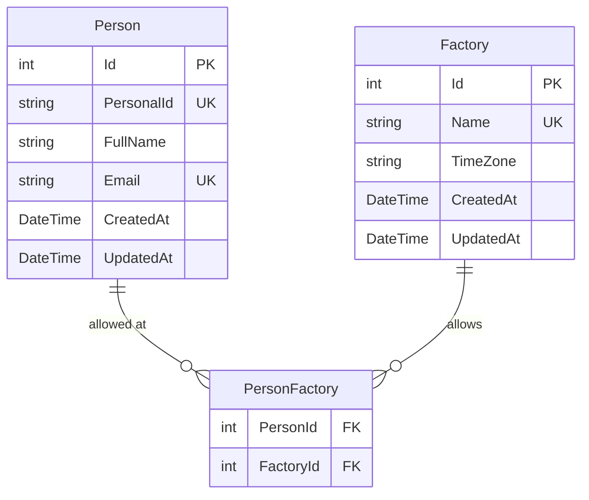

# Data Model: Personnel

> Companion to `feature-spec-personnel.md`.
> Documents the many-to-many relationship between Person and Factory via the implicit `PersonFactory` join table.

---

## Entity Relationship Diagram



---

## Entity Definitions

### Person

Extends `BaseEntity` (`Id: int`, `CreatedAt`, `UpdatedAt`).

| Property | C# Type | Required | Constraints | Notes |
|----------|---------|----------|-------------|-------|
| `PersonalId` | `string` | yes | max 100, unique (case-insensitive) | Business identifier (badge ID, employee number) |
| `FullName` | `string` | yes | max 200 | |
| `Email` | `string` | yes | max 300, unique (case-insensitive), valid format | |
| `AllowedFactories` | `ICollection<Factory>` | — | — | Navigation property for many-to-many |

### PersonFactory (implicit join table)

EF Core implicit many-to-many — no explicit C# entity class exists.

| Column | Type | Constraints | Notes |
|--------|------|-------------|-------|
| `PersonId` | `int` | FK → `Person.Id` | Part of composite PK |
| `FactoryId` | `int` | FK → `Factory.Id` | Part of composite PK |

---

## EF Core Configuration

From `ApplicationDbContext.OnModelCreating`:

```csharp
modelBuilder.Entity<Person>(entity =>
{
    entity.HasIndex(p => p.PersonalId).IsUnique();
    entity.HasIndex(p => p.Email).IsUnique();
    entity.HasMany(p => p.AllowedFactories)
          .WithMany()
          .UsingEntity("PersonFactory");
});
```

Key points:
- **Implicit join table** — EF Core manages `PersonFactory` automatically. No explicit `PersonFactory` entity class needed.
- **`.WithMany()` (no navigation)** — Factory does not have a `Persons` navigation property back to Person. The relationship is navigable only from Person → Factories.
- **Cascade on Person delete** — Deleting a `Person` cascades to remove its `PersonFactory` rows (EF default for required FKs in join tables).

---

## Indexes

| Table | Columns | Type | Purpose |
|-------|---------|------|---------|
| `Personnel` | `PersonalId` | Unique | Enforce unique business identifier |
| `Personnel` | `Email` | Unique | Enforce unique email |
| `PersonFactory` | `(PersonId, FactoryId)` | Composite PK (unique) | Prevent duplicate person-factory assignments |

---

## Soft-Delete Behavior

| Trigger | Effect | Implementation |
|---------|--------|---------------|
| Delete `Person` | 1. `ReservationPerson.PersonId` set to null (snapshot preserved) | Service nulls FK before delete |
| Delete `Person` | 2. `PersonFactory` rows cascade-deleted | EF Core default cascade |
| Delete `Factory` | `PersonFactory` rows for that factory cascade-deleted | EF Core default cascade |

> When a Person is deleted, the service explicitly sets `PersonId = null` on all linked `ReservationPerson` rows **before** deleting the Person record. The `PersonDisplayName` snapshot on each `ReservationPerson` is left untouched, preserving historical data.
