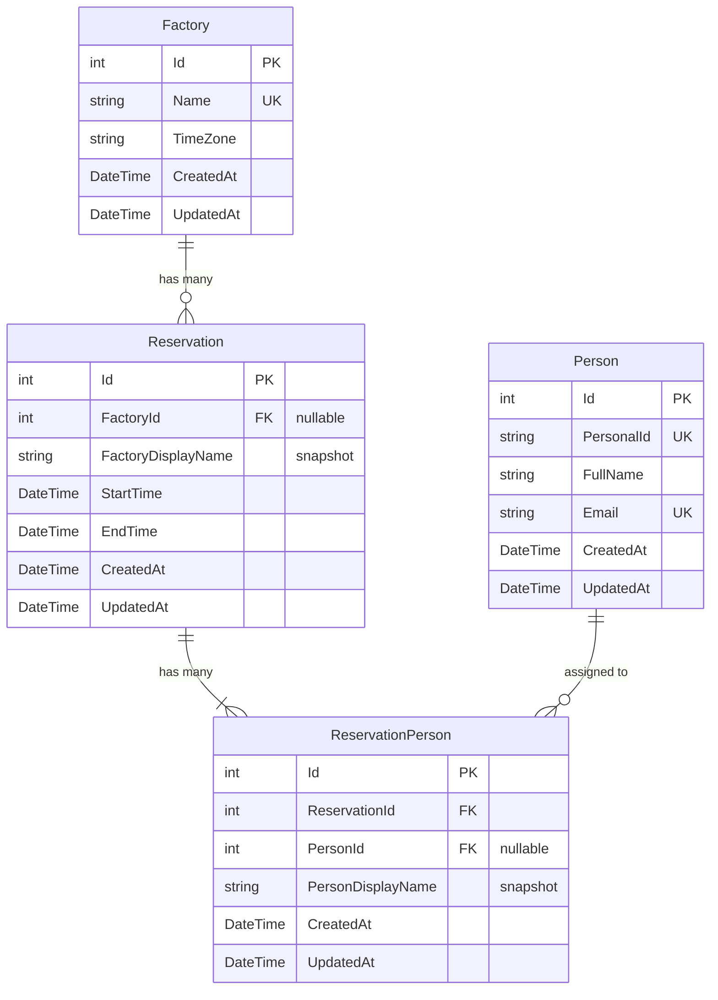

# Data Model: Reservations

> Companion to `feature-spec-reservations.md`.
> Documents the multi-entity structure: Reservation → ReservationPerson → Person, and Reservation → Factory,
> including snapshot fields, soft-delete cascades, and overlap detection.

---

## Entity Relationship Diagram



---

## Entity Definitions

### Reservation

Extends `BaseEntity` (`Id: int`, `CreatedAt`, `UpdatedAt`).

| Property | C# Type | Required | Constraints | Notes |
|----------|---------|----------|-------------|-------|
| `FactoryId` | `int?` | no | FK → `Factory.Id`, nullable | Set to null when factory is deleted |
| `FactoryDisplayName` | `string` | yes | max 200 | Snapshot of `Factory.Name`; updated on rename, frozen on delete |
| `Factory` | `Factory?` | — | — | Optional navigation property |
| `StartTime` | `DateTime` | yes | UTC | Must be before `EndTime` |
| `EndTime` | `DateTime` | yes | UTC | Must be after `StartTime` |
| `ReservationPersonnel` | `ICollection<ReservationPerson>` | — | — | Navigation property |

### ReservationPerson

Extends `BaseEntity` (`Id: int`, `CreatedAt`, `UpdatedAt`).

| Property | C# Type | Required | Constraints | Notes |
|----------|---------|----------|-------------|-------|
| `ReservationId` | `int` | yes | FK → `Reservation.Id` | Cascade delete when reservation is deleted |
| `PersonId` | `int?` | no | FK → `Person.Id`, nullable | Set to null when person is deleted |
| `PersonDisplayName` | `string` | yes | max 300 | Snapshot of `Person.FullName`; updated on rename, frozen on delete |
| `Reservation` | `Reservation` | — | — | Navigation property |
| `Person` | `Person?` | — | — | Optional navigation property |

---

## EF Core Configuration

From `ApplicationDbContext.OnModelCreating`:

```csharp
modelBuilder.Entity<Reservation>(entity =>
{
    entity.HasOne(r => r.Factory)
          .WithMany()
          .HasForeignKey(r => r.FactoryId)
          .OnDelete(DeleteBehavior.SetNull);
});

modelBuilder.Entity<ReservationPerson>(entity =>
{
    entity.HasOne(rp => rp.Reservation)
          .WithMany(r => r.ReservationPersonnel)
          .HasForeignKey(rp => rp.ReservationId)
          .OnDelete(DeleteBehavior.Cascade);

    entity.HasOne(rp => rp.Person)
          .WithMany()
          .HasForeignKey(rp => rp.PersonId)
          .OnDelete(DeleteBehavior.SetNull);
});
```

Key points:
- **No navigation from Factory/Person back to Reservations** — `.WithMany()` has no lambda, so Factory and Person don't have `Reservations` collection properties.
- **ReservationPerson extends BaseEntity** — unlike a pure join table, it has its own `Id`, `CreatedAt`, `UpdatedAt` plus snapshot fields. This is not an implicit EF join table.

---

## Indexes

| Table | Columns | Type | Purpose |
|-------|---------|------|---------|
| `Reservations` | `Id` | PK | Primary key (from BaseEntity) |
| `Reservations` | `FactoryId` | FK index | Fast lookups by factory filter |
| `ReservationPersonnel` | `Id` | PK | Primary key (from BaseEntity) |
| `ReservationPersonnel` | `ReservationId` | FK index | Fast cascade delete and eager loading |
| `ReservationPersonnel` | `PersonId` | FK index | Fast lookups by person filter |

---

## Soft-Delete Behavior

| Trigger | Effect | Implementation |
|---------|--------|---------------|
| Delete `Factory` | `Reservation.FactoryId` set to null | `OnDelete(DeleteBehavior.SetNull)` — EF handles automatically |
| Delete `Factory` | `Reservation.FactoryDisplayName` preserved | Snapshot field remains untouched |
| Delete `Person` | `ReservationPerson.PersonId` set to null | Service nulls FK explicitly before deleting Person |
| Delete `Person` | `ReservationPerson.PersonDisplayName` preserved | Snapshot field remains untouched |
| Delete `Reservation` | All `ReservationPerson` rows cascade-deleted | `OnDelete(DeleteBehavior.Cascade)` |

---

## Snapshot Field Strategy

Display name fields (`FactoryDisplayName`, `PersonDisplayName`) serve two purposes:

1. **Live updates** — When a Factory or Person is renamed, the service updates all linked snapshot fields to reflect the new name.
2. **Deletion preservation** — When a Factory or Person is deleted, the FK becomes null but the snapshot retains the last known name, so historical reservations remain readable.

| Event | FactoryDisplayName | PersonDisplayName |
|-------|-------------------|-------------------|
| Factory renamed | Updated to new `Factory.Name` | — |
| Person renamed | — | Updated to new `Person.FullName` |
| Factory deleted | Frozen (FK becomes null) | — |
| Person deleted | — | Frozen (FK becomes null) |

---

## Overlap Detection

The service prevents double-booking a person. Before creating or updating a reservation, it checks:

```
existing.EndTime > request.StartTime AND existing.StartTime < request.EndTime
```

- On **create**: checks all existing reservations for each person in `PersonIds`.
- On **update**: same check but **excludes the current reservation** from the overlap query to allow updating a reservation's own time range.
