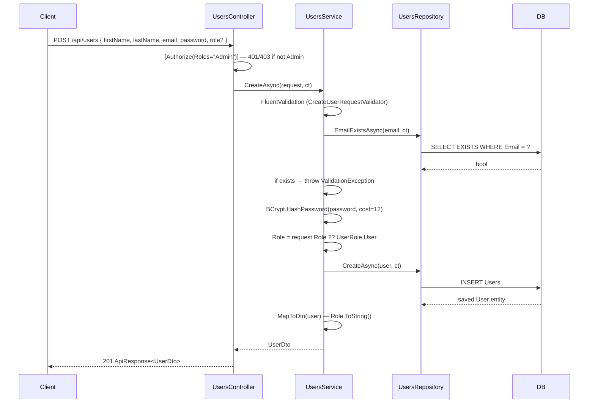
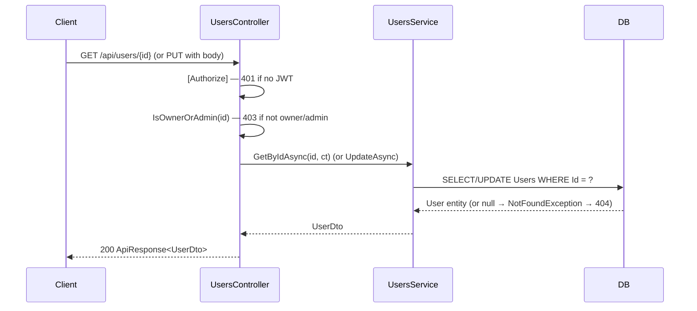

# Feature Specification: Users

**Last Updated:** `2026-03-14`
**Tests written:** no

---

## 1. Entity

**Name:** `User`
**Table name (plural):** `Users`

### Fields

| Property       | C# Type    | Required | Constraints                               | Notes                                                                    |
| -------------- | ---------- | -------- | ----------------------------------------- | ------------------------------------------------------------------------ |
| `FirstName`    | `string`   | yes      | max 100 chars                             |                                                                          |
| `LastName`     | `string`   | yes      | max 100 chars                             |                                                                          |
| `Email`        | `string`   | yes      | max 256 chars, unique index               | Stored lowercase; used as login identifier                               |
| `PasswordHash` | `string?`  | no       | nullable                                  | Null for OAuth-only users; local login rejects 401 when null             |
| `Role`         | `UserRole` | yes      | enum (`User`, `Admin`); stored as string (max 50) in DB | Defaults to `UserRole.User` on create; only Admin callers may change it |
| `IsActive`     | `bool`     | yes      | default `true`                            | Deactivated users cannot log in                                          |

> `Id` (int), `CreatedAt`, `UpdatedAt` are inherited from `BaseEntity` — do not add them.

### UserRole Enum

`UserRole` is defined in `Common/Models/UserRole.cs` with `[JsonConverter(typeof(JsonStringEnumConverter))]` so it serializes as a string (`"User"` / `"Admin"`) in API responses.

```
public enum UserRole { User, Admin }
```

EF Core stores it as a string column (max 50 chars) via `.HasConversion<string>().HasMaxLength(50)` in `ApplicationDbContext`.

---

## Relationships

- Used as the owner/actor by the Authentication feature (`RefreshToken.UserId` FK)
- No other entity relationships at this time

---

## 2. Core Values & Principles

- **Role is an enum, not a magic string.** `UserRole` is the only valid type for `User.Role` in C#. The string representation (`"User"` / `"Admin"`) is only used at the API boundary and in JWT claims.
- **Only admins can elevate roles.** A non-admin caller submitting a `Role` value in `UpdateUserRequest` has that field silently ignored — the existing role is preserved. This prevents privilege escalation.
- **User creation is admin-only.** `POST /api/users` requires `Admin` role. Self-registration is not supported through this endpoint; auth flows (OAuth, future self-service) are handled by the Auth feature.
- **IDOR protection on individual records.** `GET /api/users/{id}` and `PUT /api/users/{id}` are accessible only to the resource owner or an Admin. A regular user cannot read or modify another user's profile.
- **Emails are normalized to lowercase.** All email storage and lookups use `email.ToLowerInvariant()` to ensure case-insensitive uniqueness.
- **Deactivated users are not deleted.** `IsActive = false` is the soft-disable state. Deletion (`DELETE /api/users/{id}`) is a hard delete, admin-only.

---

## 3. Architecture Decisions

### IDOR protection via `IsOwnerOrAdmin` helper in the controller

**Decision:** The ownership check lives in `UsersController` as a private `IsOwnerOrAdmin(int resourceUserId)` method. It reads the `sub` / `NameIdentifier` claim from the JWT and compares it to the requested resource ID. If the check fails, the controller returns `403 Forbidden` before calling the service.

**Alternatives Considered:**
- Passing `callerId` into the service layer and performing the check there.
- Using a policy-based authorization handler.

**Rationale:** The check is purely about "who is the caller vs. who owns this record" — it does not require any business logic or DB lookup. Keeping it in the controller keeps the service interface clean (callers don't need to pass their own identity) and avoids an extra round-trip to the DB. A policy handler would add indirection without benefit for this simple two-case rule.

### Role changes are admin-gated via an `isAdmin` flag in the service

**Decision:** `UpdateAsync(int id, UpdateUserRequest request, bool isAdmin, ...)` receives an `isAdmin` boolean from the controller. Role is only applied when `isAdmin && request.Role.HasValue`. Non-admin callers have their `Role` field silently dropped.

**Alternatives Considered:**
- Stripping `Role` from the request DTO before calling the service (controller-level sanitization).
- Throwing 403 if a non-admin submits a `Role` value.

**Rationale:** Silent ignore is more user-friendly for clients that always send the full object regardless of role. Throwing 403 would break clients that include `Role` in a standard update payload even when they don't intend to change it. The service receives the flag rather than re-deriving it from claims, keeping the service testable without mocking `HttpContext`.

### `UserRole` as a C# enum stored as string in DB

**Decision:** `User.Role` is typed as `UserRole` (enum) in C#. EF Core converts it to a string column in the database via `.HasConversion<string>().HasMaxLength(50)`. The API serializes it as a string via `[JsonConverter(typeof(JsonStringEnumConverter))]`.

**Alternatives Considered:**
- `string` field throughout (magic strings).
- Integer-backed enum stored as int in DB.

**Rationale:** The enum prevents invalid role values from being assigned in C# (compile-time safety). String storage in the DB makes migrations readable and avoids integer/enum ordinal drift. String serialization in the API makes client code self-documenting — `"Admin"` is clearer than `1`.

---

## 4. Data Flow

### Create User (Admin only)



**Flow walkthrough:**

1. Client sends POST with credentials and optional `Role` (defaults to `"User"` if omitted).
2. Controller enforces `Admin` role via `[Authorize(Roles = "Admin")]` — non-admins get 401/403 before the service is called.
3. Service runs FluentValidation; if invalid, throws `ValidationException` → 400.
4. Service checks email uniqueness; duplicate → `ValidationException` → 400.
5. Service BCrypt-hashes the password (cost factor 12) and constructs the `User` entity.
6. Repository inserts and returns the saved entity.
7. `MapToDto` calls `user.Role.ToString()` to produce the string for `UserDto.Role`.

### Get / Update User (Owner or Admin)



**Flow walkthrough for Update:**

1. Controller reads `sub` / `NameIdentifier` claim from JWT. Compares to `{id}`. Returns 403 immediately if caller is neither the owner nor Admin.
2. Controller determines `isAdmin = User.IsInRole("Admin")` and passes it to `UpdateAsync`.
3. Service applies `FirstName`, `LastName`, `Email` changes. Role is only applied when `isAdmin && request.Role.HasValue`.

---

## 5. API Endpoints

| Method     | Route                | Description                   | Auth required          |
| ---------- | -------------------- | ----------------------------- | ---------------------- |
| `GET`      | `/api/users`         | Paginated list of all users   | yes — Admin only       |
| `GET`      | `/api/users/{id}`    | Get single user profile       | yes — owner or Admin   |
| `POST`     | `/api/users`         | Create new user               | yes — Admin only       |
| `PUT`      | `/api/users/{id}`    | Update user profile           | yes — owner or Admin   |
| `DELETE`   | `/api/users/{id}`    | Hard-delete user              | yes — Admin only       |

Query parameters for `GET /api/users`: `page` (default 1), `pageSize` (default 20, max 100).

---

## 6. Validation Rules

### `CreateUserRequest`

| Field       | Rules                                                                                                                              |
| ----------- | ---------------------------------------------------------------------------------------------------------------------------------- |
| `FirstName` | required, not empty, max 100 characters                                                                                            |
| `LastName`  | required, not empty, max 100 characters                                                                                            |
| `Email`     | required, not empty, valid email format, max 256 characters; must be unique (checked in service after FluentValidation passes)     |
| `Password`  | required, not empty, min 8 characters, must contain at least one uppercase letter, one lowercase letter, and one digit             |
| `Role`      | optional (`UserRole?`); if provided, must be a valid `UserRole` enum value — no explicit FluentValidation rule (enum binding rejects invalid values at deserialization) |

### `UpdateUserRequest`

| Field       | Rules                                                                                                                              |
| ----------- | ---------------------------------------------------------------------------------------------------------------------------------- |
| `FirstName` | required, not empty, max 100 characters                                                                                            |
| `LastName`  | required, not empty, max 100 characters                                                                                            |
| `Email`     | required, not empty, valid email format, max 256 characters; must be unique excluding current user (checked in service)            |
| `Role`      | optional (`UserRole?`); silently ignored when caller is not Admin — no validation error                                            |

### Pagination (service-level)

- `page`: must be ≥ 1
- `pageSize`: must be between 1 and 100

---

## 7. Business Rules

- **Email uniqueness:** Emails are normalized to lowercase before storage and comparison. Creating or updating to an email that already belongs to another user throws `ValidationException` → 400.
- **Password hashing:** All passwords are hashed with BCrypt (cost factor 12). Plain-text passwords are never stored or logged.
- **Default role on create:** If `CreateUserRequest.Role` is null, the created user gets `UserRole.User`.
- **Role change gate:** During update, `Role` is only applied when `isAdmin == true && request.Role.HasValue`. Non-admin callers submitting a `Role` value have it silently ignored — the existing role is preserved without error.
- **Hard delete:** `DELETE /api/users/{id}` permanently removes the record. No soft-delete / `IsActive` toggle via this endpoint. Deactivation is a future concern.
- **Seed admin user:** On startup in the Development environment, `DataSeeder.SeedAdminUserAsync` creates one Admin user if none exists. The password defaults to `"password123"` (overridable via `Seed:AdminPassword` in configuration). Check is by email (`admin@example.com`) — idempotent.

### Acceptance Scenarios

**Scenario: Admin creates a user**

- Given: POST `/api/users` with valid `FirstName`, `LastName`, `Email`, `Password` fields; caller has Admin JWT
- When: the request is processed
- Then: returns 201 with `ApiResponse<UserDto>` containing the created user; `Role` is `"User"` if omitted from request

**Scenario: Admin creates a user with explicit Admin role**

- Given: POST `/api/users` with `Role: "Admin"`; caller has Admin JWT
- When: the request is processed
- Then: returns 201 with `UserDto.Role = "Admin"`

**Scenario: Non-admin attempts to create a user**

- Given: POST `/api/users` with a valid JWT whose role is `"User"`
- When: the request is processed
- Then: returns 403 Forbidden

**Scenario: Create with duplicate email**

- Given: POST `/api/users` with an email that already belongs to another user
- When: the request is processed
- Then: returns 400 with validation error `"A user with this email already exists."`

**Scenario: Owner reads their own profile**

- Given: GET `/api/users/{id}` where `id` matches the caller's JWT `sub` claim
- When: the request is processed
- Then: returns 200 with `ApiResponse<UserDto>`

**Scenario: Regular user reads another user's profile (IDOR attempt)**

- Given: GET `/api/users/{id}` where `id` does not match the caller's JWT `sub` claim and caller is not Admin
- When: the request is processed
- Then: returns 403 Forbidden

**Scenario: Admin reads any user profile**

- Given: GET `/api/users/{id}` with an Admin JWT, any `id`
- When: the request is processed
- Then: returns 200 with `ApiResponse<UserDto>`

**Scenario: Owner updates their profile (cannot change role)**

- Given: PUT `/api/users/{id}` from the resource owner with `Role: "Admin"` in the body
- When: the request is processed
- Then: returns 200; `Role` field is unchanged from the user's existing role (silently ignored)

**Scenario: Admin updates another user's role**

- Given: PUT `/api/users/{id}` from an Admin with `Role: "Admin"` in the body
- When: the request is processed
- Then: returns 200; `UserDto.Role = "Admin"`

**Scenario: Get non-existent user**

- Given: GET `/api/users/{id}` where no user exists with that ID
- When: the request is processed
- Then: returns 404 with `NotFoundException` message

**Scenario: Admin paginates users**

- Given: GET `/api/users?page=2&pageSize=10` with an Admin JWT
- When: the request is processed
- Then: returns 200 with `ApiResponse<PagedResult<UserDto>>` containing at most 10 users for page 2

---

## 8. Authorization

| Endpoint               | Rule                                      |
| ---------------------- | ----------------------------------------- |
| `GET /api/users`       | `[Authorize(Roles = "Admin")]`            |
| `GET /api/users/{id}`  | `[Authorize]` + `IsOwnerOrAdmin` check    |
| `POST /api/users`      | `[Authorize(Roles = "Admin")]`            |
| `PUT /api/users/{id}`  | `[Authorize]` + `IsOwnerOrAdmin` check    |
| `DELETE /api/users/{id}` | `[Authorize(Roles = "Admin")]`          |

`IsOwnerOrAdmin` reads the `NameIdentifier` (or `sub`) claim from the JWT. Returns `false` (→ 403) if the claim cannot be parsed as an int or if the parsed value does not match the resource `id` and the caller is not in the `"Admin"` role.

---

## 9. Frontend UI Description

### Design reference

No Figma design — standard admin user management page.

### Description

Admin-only user management table page. Layout:

- Page title "Users" with a "New User" button (visible only to Admin; Admin-only endpoint means button is always visible when this page is reachable)
- Search/filter bar (search by name or email — future; currently pagination only)
- Paginated table with columns: ID, First Name, Last Name, Email, Role (badge: `User` = default, `Admin` = highlighted), Active (boolean indicator), Created At, Actions dropdown
- Actions dropdown per row: Edit, Delete (Admin-only actions)
- Create/Edit opens a modal form dialog with fields: First Name, Last Name, Email, Password (create only), Role (select: User / Admin — Admin sees this field; non-admin editing own profile does not see Role field or it is disabled)
- Delete opens a confirmation dialog
- Skeleton loading while fetching; empty state message when no users

---

## 10. Redux UI State

- `searchQuery: string` — current text in the search/filter input
- `selectedIds: number[]` — IDs of checked rows (for future bulk actions)

> Server data (user list, individual user) lives in React Query — not duplicated in Redux.

---

## 11. File Locations

### Backend

| File                 | Path                                                                       |
| -------------------- | -------------------------------------------------------------------------- |
| UserRole enum        | `backend/src/Backend.Api/Common/Models/UserRole.cs`                        |
| User entity          | `backend/src/Backend.Api/Features/Users/User.cs`                           |
| DTOs                 | `backend/src/Backend.Api/Features/Users/UserDtos.cs`                       |
| Validator            | `backend/src/Backend.Api/Features/Users/UsersValidator.cs`                 |
| Repository interface | `backend/src/Backend.Api/Features/Users/IUsersRepository.cs`               |
| Repository           | `backend/src/Backend.Api/Features/Users/UsersRepository.cs`                |
| Service interface    | `backend/src/Backend.Api/Features/Users/IUsersService.cs`                  |
| Service              | `backend/src/Backend.Api/Features/Users/UsersService.cs`                   |
| Controller           | `backend/src/Backend.Api/Features/Users/UsersController.cs`                |
| Data seeder          | `backend/src/Backend.Api/Data/DataSeeder.cs`                               |
| DbContext (Role conv)| `backend/src/Backend.Api/Data/ApplicationDbContext.cs`                     |

### Frontend

| File            | Path                                                                        |
| --------------- | --------------------------------------------------------------------------- |
| Page component  | `frontend/src/features/users/components/users-page.tsx`                     |
| Table component | `frontend/src/features/users/components/users-table.tsx`                    |
| Form dialog     | `frontend/src/features/users/components/user-form-dialog.tsx`               |
| Delete dialog   | `frontend/src/features/users/components/user-delete-dialog.tsx`             |
| Pagination hook | `frontend/src/features/users/hooks/use-users-pagination.ts`                 |
| Redux slice     | `frontend/src/features/users/store/users-slice.ts`                          |
| Route           | `frontend/src/routes/users/index.tsx`                                       |
| Generated API   | `frontend/src/api/generated/users/`                                         |

---

## 12. Tests

**Tests written:** no

### Backend Unit Tests

| Test                                                          | Description                                              |
| ------------------------------------------------------------- | -------------------------------------------------------- |
| `CreateAsync_WithValidData_ReturnsUserDto`                    | Happy path — user created, role defaults to User         |
| `CreateAsync_WithExplicitAdminRole_CreatesAdminUser`          | Admin role propagated when provided                      |
| `CreateAsync_WithDuplicateEmail_ThrowsValidationException`    | 400 on duplicate email                                   |
| `CreateAsync_WithWeakPassword_ThrowsValidationException`      | Password rules enforced                                  |
| `GetByIdAsync_WithInvalidId_ThrowsNotFoundException`          | 404 for missing user                                     |
| `UpdateAsync_AsAdmin_CanChangeRole`                           | Admin can elevate role                                   |
| `UpdateAsync_AsNonAdmin_RoleChangeIgnored`                    | Non-admin role change silently dropped                   |
| `UpdateAsync_WithDuplicateEmail_ThrowsValidationException`    | 400 on duplicate email (excluding self)                  |
| `GetAllAsync_ReturnsPaginatedResult`                          | Correct page, pageSize, totalCount                       |

### Frontend Tests

| Test                                          | Description                                          |
| --------------------------------------------- | ---------------------------------------------------- |
| `UsersPage renders table with user rows`      | Integration: table populated from mocked query       |
| `Create dialog submits correct payload`       | Correct DTO sent to POST endpoint                    |
| `Non-admin cannot access users page`          | Route guard redirects non-admin                      |

---

## Migration Names

1. `InitialCreate` — `Users` table already exists (covered by initial migration)
2. `AddUserRoleEnumConversion` — adds `.HasConversion<string>().HasMaxLength(50)` for `User.Role` (schema may not change if column was already `nvarchar(max)`, but EF model is updated)

> Run `dotnet ef database update` after applying migrations.

---

## Checklist

### Backend

- [x] `User` entity exists with `UserRole` enum field
- [x] `UserRole` enum created in `Common/Models/UserRole.cs`
- [x] `UserDtos.cs` — `CreateUserRequest.Role` and `UpdateUserRequest.Role` are `UserRole?`
- [x] `UsersValidator.cs` — FluentValidation rules for Create and Update
- [x] `UsersRepository` interface + implementation created
- [x] `UsersService` — `UpdateAsync` accepts `isAdmin` parameter; role-change gate implemented
- [x] `UsersController` — IDOR protection on GET/{id} and PUT/{id}; Admin-only on GET, POST, DELETE
- [x] `ApplicationDbContext` — `HasConversion<string>().HasMaxLength(50)` on `User.Role`
- [x] `DataSeeder` — uses `UserRole.Admin` enum value

### API Sync

- [ ] `npm run api:sync` run from repo root

### Frontend

- [ ] `features/users/` folder created with all layers
- [ ] Table columns match spec above
- [ ] Form fields match spec above (Role field hidden/disabled for non-admin)
- [ ] Redux slice registered in `store/index.ts`
- [ ] Route added (Admin-only guard)
- [ ] Translations added to both `en.json` and `fi.json`
